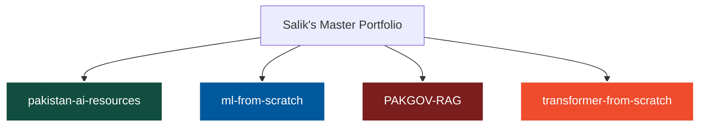

# 🚀 Salik Hussain
### **AI Researcher & Systems Engineer | Specialized in Low-Resource Urdu NLP & RAG Systems**
#### *BS Computer Science Student at Air University, Islamabad (2026–2030)*

<div align="center">
  
  
  
</div>

---

## 🎯 10-Year Vision & Long-Term Research Mission
> "Building the foundational engineering, mathematics, and architectural frameworks required to deliver democratized knowledge access systems across linguistic and socioeconomic boundaries."


```
⚡ BS CS @ Air University (2026-2030) ➔ 🎓 Fully Funded MS in AI Abroad (2032) ➔ 🔬 PhD at Elite AI Research Lab (2035) ➔ 🏢 Principal AI Research Scientist / Faculty (2038+)
```

* **Research Focus:** Low-Resource Multilingual NLP, Retrieval-Augmented Generation (RAG) Architecture, Large Language Model Optimization, Hybrid Information Retrieval, and Knowledge Graph extraction.
* **Target Global MS Labs:** MBZUAI (Primary Target), KAUST, ETH Zurich, EPFL, TU Munich, NUS, KAIST, Saarland.

---

## 🛠️ Unified Technical Stack & Ecosystem

### 💻 Languages & Scripting


### 🤖 Core AI, Machine Learning & NLP Frameworks


### ⚙️ Cloud, Infrastructure & Dev Tools


---

## 🔥 AI / ML Core Expertise & Domains

| Domain / Matrix | Proficiency Level | Handled Architecture / Milestones |
| :--- | :--- | :--- |
| **Large Language Models** | `Advanced` | Tokenization dynamics (BPE/WordPiece), Custom Sinclair Positional Encoding, Fine-Tuning Optimization (QLoRA/LoRA) |
| **Retrieval-Augmented Gen** | `Expert Strategy` | Dense Retrieval Vector Matching, Sparse BM25 Fusion, Vector-Database Management, RAGAS Matrix Scoring |
| **Natural Language Processing**| `Advanced` | Multi-lingual mBERT/XLM-RoBERTa Token Classification, Urdu Script (Nastaliq) Normalization Pipelines |
| **Deep Learning** | `Intermediate` | Gradient Descent Optimization Metrics, Sinusoidal Attention Layers ($Q, K, V$ Matrices), PyTorch nn.Module Workflow |
| **Research Engineering** | `Rigor Focused` | NumPy Algorithm Structuring from Scratch, Dataset Curation, Strict Reproducible Research Environments |

---

## 🏛️ Flagship Research Initiative

### 🇵🇰 `PAKGOV-RAG` (Bilingual Urdu-English Government Information Retrieval System)
* **Goal:** Direct knowledge abstraction pipeline for unstructured Pakistani civic documentation.
* **Coverage Scope:** Federal Board of Revenue (FBR), Higher Education Commission (HEC), National Database and Registration Authority (NADRA), Securities and Exchange Commission of Pakistan (SECP), Supreme Court of Pakistan Judgments.
* **Pipeline Infrastructure:** Text Extraction via Multi-lingual Tesseract OCR ➔ Hybrid Dense/Sparse Retrieval Embeddings Layer via XLM-RoBERTa ➔ FAISS Vector Bank Indexes ➔ Generative Synthesis via Urdu QLoRA Fine-tuned LLM.

---

## 📂 Active Core Academic Repositories Tracker


 * 📦 **pakistan-ai-resources**: Public catalog of curated Urdu NLP datasets, legal scripts, and evaluation benchmarks.
 * 📦 **ml-from-scratch**: Arrayed implementations of 10 primary ML foundational structures utilizing raw NumPy.
 * 📦 **transformer-from-scratch**: Pure PyTorch execution of the absolute multi-head attention matrix block.
## 📊 Live Metrics & Profile Telemetry
<div align="center">
<table border="0">
<tr>
<td>

</td>
<td>

</td>
</tr>
<tr>
<td colspan="2" align="center">

</td>
</tr>
</table>
</div>
## 🏅 Certifications & Professional Baselines
 * 🏆 **HackerRank Matrix:** Problem Solving, SQL (Advanced), Python (Basic) Completed.
 * 🔬 **HP LIFE Portfolio:** Critical Thinking in the AI Era & Data Science Analytics.
 * 🎓 **Harvard CS50P:** Python Software Engineering Architecture (In Progress).
## 🌐 Secure Communications & Digital Core
 * 📬 **Direct Email:** salikhussain71@gmail.com
 * 💼 **Professional Network:** LinkedIn Profile
 * 🧠 **Kaggle Kernel Bank:** Kaggle Space
 * 📢 **Research Updates Vector:** X.com / Twitter Profile
 * 📍 **Physical Base Infrastructure:** Rawalpindi, Punjab, Pakistan 🇵🇰
```
🧑‍💻 "One working project deployed > 10 planned projects. One submitted paper > 100 platform certificates. Close the plan, open the terminal."

```
```

### 💎 Why this fits your lifetime BS CS goals:
1. **[span_2](start_span)Visual Balance:** It incorporates colored shield tags, structured table formatting, and a dynamic visualization framework mapping out your 12-repo strategy[span_2](end_span).
2. **[span_3](start_span)Telemetry Widgets:** It embeds dynamic stats, streaks, and language profile blocks using `tokyonight` high-contrast color matching from the elite design patterns[span_3](end_span).
3. **[span_4](start_span)[span_5](start_span)No Fluff:** It explicitly extracts dates (Air University 2026-2030), targets (MBZUAI, KAUST), and project goals directly from your official master profile[span_4](end_span)[span_5](end_span). 

Execute this inside your GitHub Special Repository and make it real!

```
