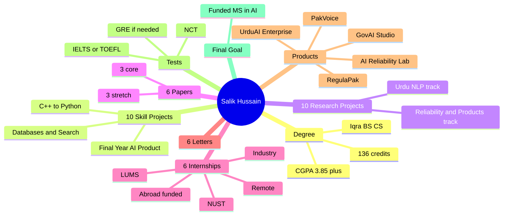
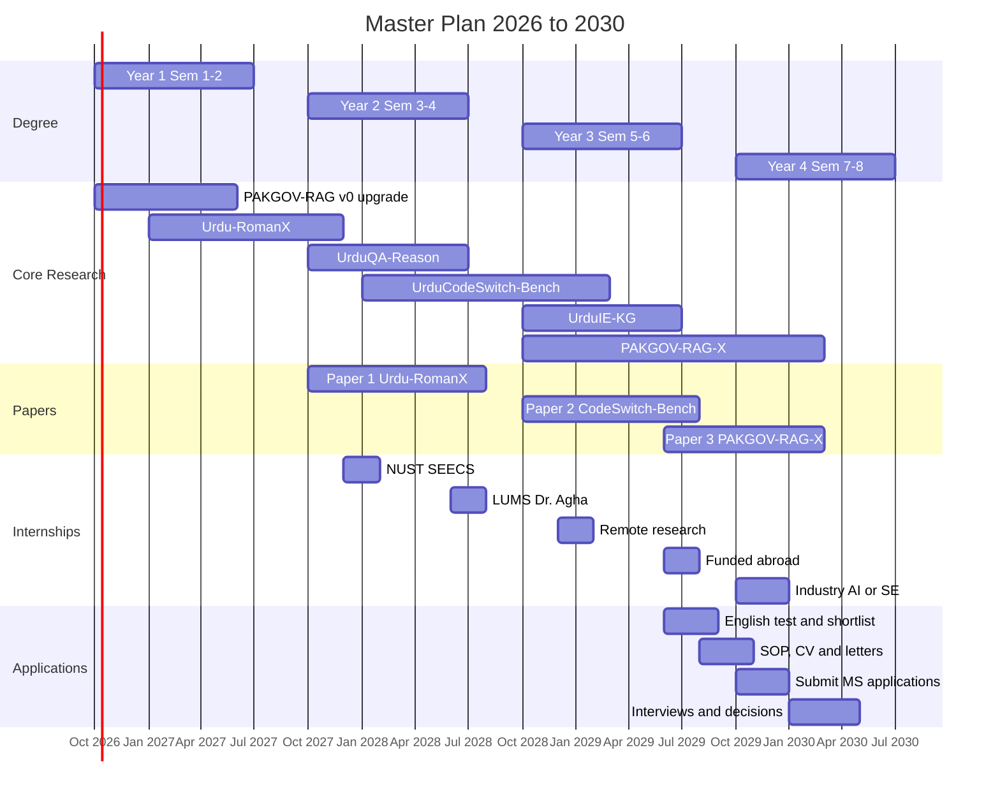
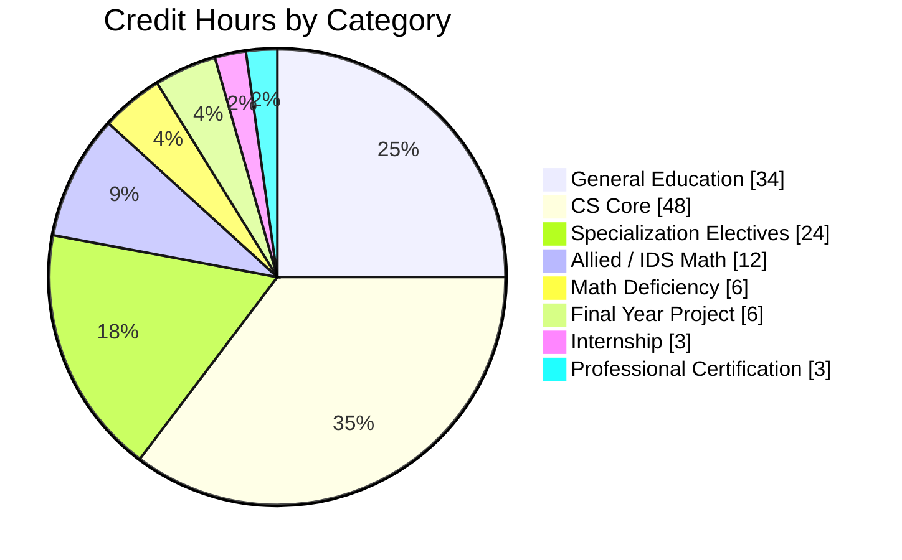
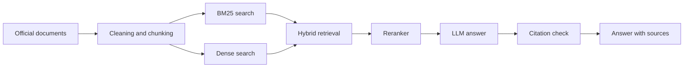
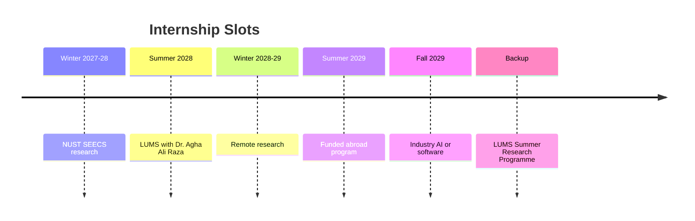
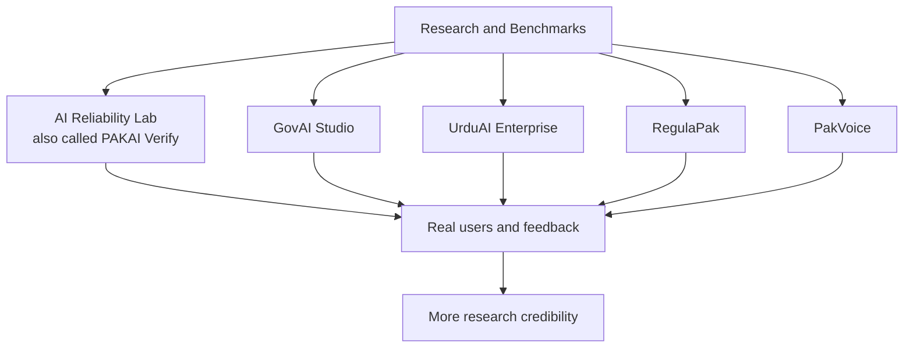
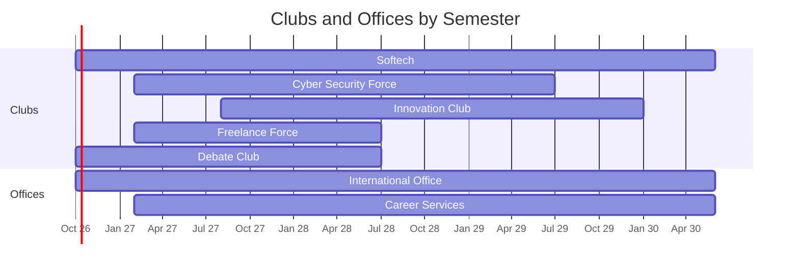
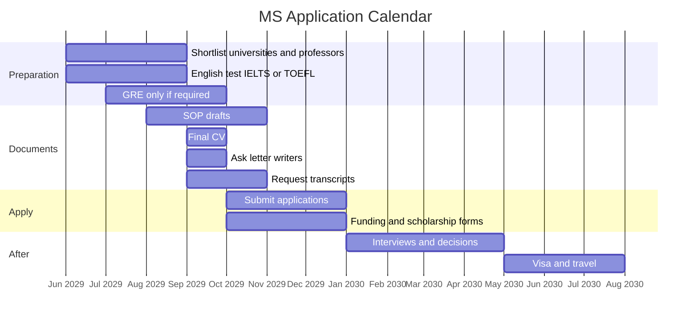

  

<picture>
  <source media="(prefers-color-scheme: dark)" srcset="https://raw.githubusercontent.com/salikhussain71-code/salikhussain71-code/output/github-contribution-grid-snake-dark.svg">
  <source media="(prefers-color-scheme: light)" srcset="https://raw.githubusercontent.com/salikhussain71-code/salikhussain71-code/output/github-contribution-grid-snake.svg">
  
</picture>

 

  

[

-8A2BE2?style=flat-square)](https://www.iqra.edu.pk/isl/)

-1E90FF?style=flat-square)

---

## 👋 About Me

Hello, I am **Salik Hussain**, a Computer Science student from Rawalpindi, Pakistan.

I started my **BS Computer Science at [Iqra University Islamabad](https://www.iqra.edu.pk/isl/) in October 2026**. My school background is Pre-Medical (F.Sc. PCB), so I follow the 136-credit pre-medical track with two extra math courses.

My research question in one line:

> **Can AI give correct, trusted answers in Urdu, Roman Urdu and Urdu-English mixed text?**

**My promise:** everything on this page is either finished, in progress, or clearly marked **Planned**. I do not claim results I have not earned yet.

### 📑 Contents

[Big Picture](#-the-big-picture) · [Priorities](#-my-priority-order) · [Year 1](#-year-1-2026-2027-foundation) · [Year 2](#-year-2-2027-2028-core-cs-and-first-research) · [Year 3](#-year-3-2028-2029-ai-core-and-elite-research) · [Year 4](#-year-4-2029-2030-flagship-and-ms-applications) · [Projects](#-the-10-skill-projects) · [Research](#-the-10-research-projects) · [Papers](#-the-6-research-papers) · [Internships](#-the-6-internships) · [Letters](#-the-6-recommendation-letters) · [Products](#-products-apps-and-agents) · [Clubs](#-university-activities) · [Tests](#-tests-sop-and-resume) · [MS Targets](#-ms-target-universities) · [Skills](#-skills-and-tools)

---

## 🗺️ The Big Picture

```mermaid
mindmap
  root((Salik Hussain))
    Degree
      Iqra BS CS
      136 credits
      CGPA 3.85 plus
    10 Skill Projects
      C++ to Python
      Databases and Search
      Final Year AI Product
    10 Research Projects
      Urdu NLP track
      Reliability and Products track
    6 Papers
      3 core
      3 stretch
    6 Internships
      LUMS
      NUST
      Abroad funded
      Remote
      Industry
    6 Letters
    Products
      AI Reliability Lab
      GovAI Studio
      UrduAI Enterprise
      RegulaPak
      PakVoice
    Tests
      NCT
      IELTS or TOEFL
      GRE if needed
    Final Goal
      Funded MS in AI
```

### 📅 Master Timeline

```mermaid
gantt
    title Master Plan 2026 to 2030
    dateFormat YYYY-MM
    axisFormat %b %Y
    section Degree
    Year 1 Sem 1-2                 :2026-10, 2027-07
    Year 2 Sem 3-4                 :2027-10, 2028-07
    Year 3 Sem 5-6                 :2028-10, 2029-07
    Year 4 Sem 7-8                 :2029-10, 2030-07
    section Core Research
    PAKGOV-RAG v0 upgrade          :2026-10, 2027-06
    Urdu-RomanX                    :2027-01, 2027-12
    UrduQA-Reason                  :2027-10, 2028-07
    UrduCodeSwitch-Bench           :2028-01, 2029-03
    UrduIE-KG                      :2028-10, 2029-07
    PAKGOV-RAG-X                   :2028-10, 2030-03
    section Papers
    Paper 1 Urdu-RomanX            :2027-10, 2028-08
    Paper 2 CodeSwitch-Bench       :2028-10, 2029-08
    Paper 3 PAKGOV-RAG-X           :2029-06, 2030-03
    section Internships
    NUST SEECS                     :2027-12, 2028-02
    LUMS Dr. Agha                  :2028-06, 2028-08
    Remote research                :2028-12, 2029-02
    Funded abroad                  :2029-06, 2029-08
    Industry AI or SE              :2029-10, 2030-01
    section Applications
    English test and shortlist     :2029-06, 2029-09
    SOP, CV and letters            :2029-08, 2029-11
    Submit MS applications         :2029-10, 2030-01
    Interviews and decisions       :2030-01, 2030-05
```

### 📊 Credit Hours (136 total, pre-medical track)

```mermaid
pie showData
    title Credit Hours by Category
    "General Education" : 34
    "CS Core" : 48
    "Specialization Electives" : 24
    "Allied / IDS Math" : 12
    "Math Deficiency" : 6
    "Final Year Project" : 6
    "Internship" : 3
    "Professional Certification" : 3
```

---

## 🎯 My Priority Order

> 🥇 **CGPA** → 🥈 **AI/CS skills** → 🥉 **Research and projects** → 4️⃣ **Internships** → 5️⃣ **Clubs**

| CGPA | Meaning | What I do |
|:--|:--|:--|
| **3.85 to 4.00** | Excellent (my target) | Keep going |
| **3.70 to 3.84** | Strong | Improve weak courses |
| **3.50 to 3.69** | Acceptable | Cut extra activities |
| **Below 3.50** | Warning | Reduce clubs, fix academics first |

**Grade plan:** A or A+ in programming, math, algorithms and AI. B+ is acceptable in general education.
**Weekly routine:** 5 short math sessions + 4 programming sessions + 1 review session. Adjust around exams.

**Rule:** I finish one project at a time. I never start five big projects together.

---

# 🎓 YEAR-BY-YEAR ROADMAP

The curriculum follows the Iqra 136-credit pre-medical plan. Items marked ⚠️ must be **confirmed with the department** (see the [question list](#-questions-for-the-department-office)).

---

## 🟢 YEAR 1 (2026 to 2027): Foundation

 

**Goal:** Strong grades, solid C++, algebra and calculus, Git habit, first research reading.

### Semester 1: Fall 2026 (16 credits, registered)

| Code | Course | Credits | What I master |
|:--|:--|:-:|:--|
| CMC111 | Programming Fundamentals + Lab (C++) | 3+1 | Variables, data types, I/O, operators, conditions, loops, functions, arrays, debugging |
| GER111 | Application of ICT + Lab | 2+1 | Computer basics, internet, office tools, HTML (PHP if my teacher covers it) |
| GER121 | Functional English | 3 | Paragraphs, essays, grammar, presentations, technical writing |
| GER152 | Applied Physics + Lab | 2+1 | Theory, formulas, units, lab reports |
| MT011 | Pre-Calculus-I (math deficiency) | 3 | Algebra, equations, functions, graphs, exponents, logs, trigonometry |

**Self-study:** C++ on [learncpp.com](https://www.learncpp.com/) · HTML and CSS · Git and GitHub · 20 to 30 minutes of math daily.
**Project 1:** Student Marks Calculator (C++).
**Target:** Explain and write small C++ programs without copying, and solve foundation math alone.

### Semester 2: Spring 2027

| Code | Course | Notes |
|:--|:--|:--|
| CMC112 + Lab | Object-Oriented Programming (C++) | Classes, inheritance, polymorphism, file handling |
| CMC121 + Lab | Digital Logic Design | Needs Applied Physics |
| Pre-Calculus-II | ⚠️ Second deficiency course, name unconfirmed | |
| IDS111 | IDS-I Calculus & Analytic Geometry ⚠️ | May move to Semester 3 |
| QR-I | Quantitative Reasoning-I | Pick Probability & Statistics if offered |
| GER241 | Pakistan Studies | |
| GEN111 | Understanding of the Holy Quran-I | |
| GERxxx | Arts & Humanities (pool) | |

**Self-study:** Python basics · a C++ library-management project.
**Project 2:** Portfolio Website (HTML, CSS, GitHub). **Project 3:** Student Record System (OOP and file handling).
**Research prep:** Learn to read an abstract, find the research question, and write a one-page literature summary. Review **PAKGOV-RAG Version 0** and list upgrades. Plan **Urdu-RomanX**. Do not rush to publish.

### Year 1 Activities

| When | Clubs and offices | Tests and documents |
|:--|:--|:--|
| Sem 1 | 💻 Softech + 🗣️ Debate. Visit the 🌍 International Office and ask about exchange eligibility | None. Practice English daily |
| Sem 2 | Softech + 🛡️ CSF + 💼 Freelance Force. First visit to 💼 Career Services | Keep an "achievements" note for the future CV |

### ✅ Year 1 Checklist

- [ ] CGPA 3.85 or higher
- [ ] Projects 1, 2, 3 on GitHub with clear READMEs
- [ ] Daily or near-daily small commits
- [ ] PAKGOV-RAG v0 reviewed
- [ ] Know my professors in programming and math (future letters)

---

## 🟡 YEAR 2 (2027 to 2028): Core CS and First Research

**Goal:** Master data structures and algorithms, learn Python and ML basics, finish my first research project and first paper draft.

### Semester 3: Fall 2027

| Code | Course | Notes |
|:--|:--|:--|
| CMC251 + Lab | Data Structures | Lists, stacks, queues, trees, hashing, complexity |
| CMC331 + Lab | Database Systems | SQL, design, normalization, joins, transactions |
| CMC262 + Lab | Computer Networks | TCP/IP, DNS, HTTP, routing |
| IDS112 | IDS-II Linear Algebra ⚠️ | Position depends on my math shift |
| QR-II | Quantitative Reasoning-II | |
| GER122 | Expository Writing | Practice research writing |
| GERxxx | Social Science (pool) | |
| GEN112 | Understanding of the Holy Quran-II | |

**Self-study:** NumPy · pandas · SQL · basic Linux · Git branches and pull requests.
**Project 4:** Data Structures Visualizer. **Project 5 (starts):** Student Performance Analytics (SQL and Python).
**Research:** Read 10 papers in Urdu NLP or multilingual retrieval. Make a table: problem, method, dataset, results, limits.

### Semester 4: Spring 2028

| Code | Course | Notes |
|:--|:--|:--|
| CMC254 | Design & Analysis of Algorithms | Divide and conquer, greedy, dynamic programming, graphs |
| CMC241 + Lab | Operating Systems | Processes, threads, scheduling, memory |
| CMC371 | Software Engineering | Requirements, testing, teamwork |
| GER141 | Islamic Studies | |
| GER142 | Ideology & Constitution of Pakistan | |
| GER443 | Civics & Community Engagement | |
| GER464 | Entrepreneurship | Use it to plan my first product |

**Self-study:** Linux · algorithm complexity · testing · probability and statistics · scikit-learn · matplotlib.
**Project 6 (starts):** Urdu-English Text Classifier.
**Research:** Write the question, dataset, baseline, metrics and limits **before** running experiments.

### Year 2 Research and Career

| Item | Plan |
|:--|:--|
| Core projects | **Urdu-RomanX** (finish) and **UrduQA-Reason** |
| Paper | **Paper 1** (Urdu-RomanX) drafted by summer 2028 |
| Internship | 🧪 NUST SEECS (winter break) and 🧪 LUMS with Dr. Agha Ali Raza (summer 2028) |
| Outreach | Email supervisors with GitHub link, results and a one-page plan |
| Clubs | Sem 3: Softech + CSF + 🚀 Innovation. Sem 4: add Freelance Force only if manageable |
| International Office | **High priority.** Check every exchange or mobility call. Apply if officially eligible |
| Career Services | First serious CV review (Sem 3), internship counselling (Sem 4) |
| Tests | 📝 NCT/HEC computing test self-check at the end of Sem 4 (DSA, databases, OS, networks, SE are fresh) |

### ✅ Year 2 Checklist

- [ ] CGPA 3.85 or higher
- [ ] Projects 4, 5, 6 done
- [ ] Urdu-RomanX results and Paper 1 draft
- [ ] First research supervisor
- [ ] CV reviewed, no "random certificate" list

---

## 🟠 YEAR 3 (2028 to 2029): AI Core and Elite Research

**Goal:** Build the benchmark, win a funded abroad research place, finish Paper 2, start my first product.

### Semester 5: Fall 2028

| Code | Course | Notes |
|:--|:--|:--|
| CMC383 + Lab | Artificial Intelligence | Search, heuristics, state-space problems |
| CSC341 | Theory of Automata | Formal languages, grammars |
| CMC224 + Lab | Computer Org. & Architecture | |
| CMC363 + Lab | Information Security | Helps my safety-testing work |
| IDS-III | Probability & Statistics ⚠️ | |
| IDS-IV | Multivariable Calculus or Discrete Math ⚠️ | |

**Self-study:** scikit-learn · PyTorch (tensors, autograd, training loops) · train/validation/test splits · baseline vs complex model.
**Project 6 (finish):** Urdu-English Text Classifier. **Project 7:** Urdu Document Search Engine.
**Apply in autumn 2028** to the funded abroad programs (see [Internships](#-the-6-internships)).

### Semester 6: Spring 2029

| Code | Course | Notes |
|:--|:--|:--|
| CMC355 | Cloud Computing | Deploy my demos |
| Elective I | Machine Learning ⚠️ | |
| Elective II | Deep Learning ⚠️ | |
| Elective III | Natural Language Processing ⚠️ | |
| Elective IV | Information Retrieval ⚠️ | |

⚠️ The elective list is a proposal. I will ask for the official list and choose the closest match.
**Self-study:** transformers · embeddings · a bilingual Urdu-English retrieval project.
**Project 8 (starts):** PAKGOV-RAG improvement (retrieval metrics, source grounding).

### Year 3 Research and Career

| Item | Plan |
|:--|:--|
| Core projects | **UrduCodeSwitch-Bench**, **UrduIE-KG**, start **PAKGOV-RAG-X**, start PAK-AI-Bench and AI Reliability Lab |
| Paper | **Paper 2** (UrduCodeSwitch-Bench) finished by summer 2029 |
| Internships | 🧪 Remote research (winter break 2028) · 🧪 Funded abroad (summer 2029) |
| Clubs | Cut time. Softech and Innovation only, selectively. CSF optional |
| International Office | Keep monitoring |
| Career Services | Sem 6: ask for AI, ML, software, data science and research internships |
| Tests | Start English test practice (Sem 6). Book **IELTS or TOEFL** for June or late August 2029 |

### ✅ Year 3 Checklist

- [ ] CGPA 3.85 or higher
- [ ] Applied to 4 abroad programs in autumn 2028
- [ ] Paper 2 ready, one serious research project in progress
- [ ] Projects 7 and 8 started or done
- [ ] English test booked

---

## 🔴 YEAR 4 (2029 to 2030): Flagship, Products and MS Applications

**Goal:** Change from "good undergraduate" to "competitive international MS applicant".

### Semester 7: Fall 2029

| Code | Course | Notes |
|:--|:--|:--|
| Elective V | Generative AI / Large Language Models ⚠️ | |
| Elective VI | Data Mining ⚠️ | |
| Elective VII | Computer Vision or Big Data Analytics ⚠️ | |
| CMC493 | Field Experience / Internship | Use a real research or industry placement if Iqra approves |
| CMC491 | Final Year Design Project (FYDP)-I | Agree on a researchable problem with my supervisor |

**Self-study:** Reproduce one published paper · pick my supervisor.
**Project 10 (starts):** Final-Year AI Product (authentication, logs, tests, deployment guide).

### Semester 8: Spring 2030

| Code | Course | Notes |
|:--|:--|:--|
| CMC492 | Final Year Design Project (FYDP)-II | Finish and demonstrate |
| Elective VIII | Advanced NLP or Reinforcement Learning ⚠️ | |
| CMC494 | Professional Certification | Can be done any time, preferably after Sem 5 |

**Final deliverables:** tested code, documentation, permitted data, methodology, baselines, results, limits, ethics, demo and final report.

### Year 4 Research and Career

| Item | Plan |
|:--|:--|
| Flagship | **PAKGOV-RAG-X** (final-year project) |
| Paper | **Paper 3** (PAKGOV-RAG-X) |
| Products | Launch first versions of GovAI Studio and UrduAI Enterprise |
| Internship | 🧪 Industry AI/ML or software internship (Sem 7, can count for CMC493) |
| Clubs | Minimal. Softech or Innovation only if useful |
| International Office and Career Services | Use any relevant opportunity. Final CV and interview review |
| Applications | See the [application calendar](#-application-calendar-for-fall-2030-entry) |

### ✅ Year 4 Checklist

- [ ] CGPA does not collapse in final year (3.85 or higher)
- [ ] FYP finished and published as open source
- [ ] SOP, CV and letters done by October 2029
- [ ] Applications sent before each official deadline
- [ ] Funding forms and scholarship applications filed

---

# 💻 THE 10 SKILL PROJECTS

These build my skills step by step. I finish fewer projects well rather than publishing many half-done repositories.

| # | Project | Stage | Main skills |
|:-:|:--|:--|:--|
| 1 | Student Marks Calculator | Sem 1 | C++, conditions, loops, functions |
| 2 | Portfolio Website | Sem 1 to 2 | HTML, CSS, GitHub |
| 3 | Student Record System | Sem 2 | OOP, file handling |
| 4 | Data Structures Visualizer | Sem 3 | Algorithms, visualization |
| 5 | Student Performance Analytics | Sem 3 to 4 | SQL, Python |
| 6 | Urdu-English Text Classifier | Sem 4 to 5 | NLP basics, evaluation |
| 7 | Urdu Document Search Engine | Sem 5 to 6 | Retrieval, embeddings |
| 8 | PAKGOV-RAG Improvement | Sem 6 to 7 | RAG, retrieval metrics, grounding |
| 9 | Urdu NLP Evaluation Benchmark | Sem 6 to 8 | Research design, reproducibility |
| 10 | Final-Year AI Product | Sem 7 to 8 | Full-stack, deployment, evaluation |

*Every project gets a README, install steps, data sources, limits, tests, examples, and a clear note of what I built myself. For government or legal documents I keep source links and document IDs, and I never claim legal accuracy.*

---

# 🔬 THE 10 RESEARCH PROJECTS

Two tracks, one coherent field: **trustworthy AI for Urdu and low-resource languages**.

**Order rule:** Track B (Urdu NLP) comes first because it matches my years. Track A projects overlap with it (for example PAK-AI-Bench shares code with PAKGOV-RAG-X), so I merge them where possible. A2, A4 and A5 are **stretch goals** that may continue after the BS or during the MS.

### Track B: Urdu NLP (core, in the BS)

| # | Project | Question | Time |
|:-:|:--|:--|:-:|
| B1 | **Urdu-RomanX** | Do models understand Urdu script, Roman Urdu and Urdu-English equally well? | Y1 to Y2 |
| B2 | **UrduQA-Reason** | Can AI answer with evidence, multi-step reasoning and "no answer" cases? | Y2 |
| B3 | **UrduCodeSwitch-Bench** | How reliable and safe is AI across language forms? | Y2 to Y3 |
| B4 | **UrduIE-KG** | Can we extract people, places, laws and relations from Urdu text? | Y3 |
| B5 | **PAKGOV-RAG-X** ⭐ | Can AI answer Pakistani government questions with real sources? | Y3 to Y4 |

### Track A: Reliability and Products

| # | Project | Question | Time |
|:-:|:--|:--|:-:|
| A1 | **PAK-AI-Bench** | How reliable are RAG systems in English, Urdu, Roman Urdu and mixed text? | Y3 to Y4 (12 to 18 months) |
| A2 | **PAK-Multilingual-AI** | How does AI behave across Urdu, Roman Urdu, English, Urdu-English and Pashto? | Y4 and later (18 to 24 months) |
| A3 | **AI Public-Service Reliability Lab** | Can we trust public-information AI? Tests hallucination, prompt injection, regression | Y3 to Y4 |
| A4 | **RegulaPak** | What changed in an official regulation, and where is the proof? | Stretch (12 to 18 months) |
| A5 | **PakVoice** | Can Urdu and English voice AI answer with evidence? | Stretch (12 to 18 months) |

### ⭐ Flagship: PAKGOV-RAG-X

My earlier PAKGOV-RAG is **Version 0 (pilot)**. I upgrade it step by step.

```mermaid
flowchart LR
    A[Official documents] --> B[Cleaning and chunking]
    B --> C[BM25 search]
    B --> D[Dense search]
    C --> E[Hybrid retrieval]
    D --> E
    E --> F[Reranker]
    F --> G[LLM answer]
    G --> H[Citation check]
    H --> I[Answer with sources]
```

**Measured with:** Recall@5, Recall@10, MRR, nDCG, answer correctness, groundedness, citation precision and recall, unsupported claims, hallucination, abstention, speed and cost.

<b>Details: Track B projects</b>

**B1 Urdu-RomanX:** Robust Representation Learning for Urdu, Roman Urdu and Urdu-English Code-Switched Text. Study tokenization, transliteration, continued pretraining, PEFT, cross-script transfer. Tasks: classification, NER, sentiment, similarity, retrieval, QA. Compare mBERT, XLM-R and existing Urdu models first; build my own model only if experiments justify it. Outputs: dataset, benchmark, evaluation suite, Hugging Face page, web demo, paper.

**B2 UrduQA-Reason:** Evidence-Grounded, Multi-Hop and Unanswerable QA for Urdu and Urdu-English Public Information. Urdu QA already exists (for example UQA, LREC-COLING 2024), so mine adds multi-hop, comparison, unanswerable and conflicting-evidence questions with citations. Pipeline: Question → Retriever → Evidence → Reranker → LLM → Answer → Citation check. Outputs: dataset, benchmark, leaderboard, baselines, evaluation library.

**B3 UrduCodeSwitch-Bench:** Reliability, Factuality, Safety and Robustness Evaluation Across Urdu, Roman Urdu and Urdu-English Code-Switching. Tests QA, classification, retrieval, summarization, factuality, hallucination, safety, consistency across several model families.

**B4 UrduIE-KG:** Urdu Information Extraction, Entity Linking, Relation Extraction and Knowledge-Graph Construction. Pipeline: documents → NER → entity linking → relations → events → knowledge graph. Tools: Transformers, PyTorch, Wikidata, graph databases.

**B5 PAKGOV-RAG-X:** Evidence-Grounded Bilingual RAG for Pakistani Government, Legal and Public Information in English, Urdu and Roman Urdu. Compares BM25, Dense, Hybrid, Hybrid + Reranker, RAG, RAG + Verification.

<b>Details: Track A projects</b>

**A1 PAK-AI-Bench:** A reliability benchmark for Urdu-English and code-switched RAG. Tasks: retrieval, QA, evidence selection, citation verification, hallucination detection, answerability, multilingual robustness. Systems: BM25, dense, hybrid, reranking, RAG, LLM-only, RAG + verification. Domains: government, education, law, public services, science, technology.

**A2 PAK-Multilingual-AI:** Start with Urdu + English, then Roman Urdu, then Pashto. I do not start with ten languages. Tasks: classification, similarity, retrieval, NER, QA, sentiment, summarization, language identification.

**A3 AI Public-Service Reliability Lab:** Evaluation platform for reliability (hallucination, factuality, grounding, citations), security (prompt injection, malicious documents), multilingual robustness, and regression (Model v1 vs v2). Output: an automatic **AI Reliability Report** with score, failure types, examples, evidence, severity and recommendations.

**A4 RegulaPak:** Official documents → ingestion → version detection → comparison → change detection → AI explanation → evidence → human review → alert. Shows what changed, when, which section and the official source.

**A5 PakVoice:** Voice → speech recognition → language ID → query → retrieval → evidence → LLM → citation check → text-to-speech. Not a general Siri. The question is how low-resource voice systems give reliable, evidence-grounded answers.

### 🧩 Outputs I Aim to Release

| Type | Target |
|:--|:--|
| 🤖 **Models (3 families)** | Urdu-Roman Representation Model · PAK-RAG Reranker · PAK-AI Reliability Evaluator |
| 📦 **Datasets (4)** | PAK-AI-Bench Dataset · PAK-MultiText · PAK-RegChange · PAKVoice Evaluation Dataset |
| 📊 **Benchmarks (3)** | PAK-AI-Bench · PAK-MultiBench · PAK-ReliabilityBench |

⚠️ Every dataset must respect licenses, privacy, platform terms and source permissions.

---

# 📚 THE 6 RESEARCH PAPERS

### Core 3 (written during the BS)

| # | Title | From | Possible venues | When |
|:-:|:--|:--|:--|:-:|
| 1 | Urdu-RomanX: Robust Representation Learning Across Urdu, Roman Urdu and Urdu-English Text | B1 | [ACL](https://aclrollingreview.org/) · EMNLP · [NAACL](https://naacl.org/) · COLING | Draft Y2, submit Y3 |
| 2 | UrduCodeSwitch-Bench: Reliability, Factuality and Safety Evaluation Across Urdu, Roman Urdu and Code-Switched Text | B3 | ACL · EMNLP · NAACL · [NeurIPS Evaluations & Datasets](https://neurips.cc/) | Y3 to Y4 |
| 3 | PAKGOV-RAG-X: Evidence-Grounded Bilingual RAG for Pakistani Government and Public Information | B5 | ACL · EMNLP · NAACL · [SIGIR](https://sigir.org/) · NeurIPS E&D | Y4 |

### Stretch 3 (as time allows, may merge with the core 3)

| # | Title | From | When |
|:-:|:--|:--|:-:|
| 4 | PAK-AI-Bench: Evaluating RAG Reliability in Urdu-English and Code-Switched Public Information | A1 | 2028 to 2029 |
| 5 | Measuring Low-Resource Multilingual Performance Gaps Across Urdu, Roman Urdu, Pashto and English | A2 | 2029 and later |
| 6 | Reliable and Auditable RAG for Public-Service Information: Multilingual Grounding, Robustness and Evidence Verification | A3 + A4 + A5 | 2029 to 2030 |

**Honest rules:** A paper is an outcome, not a guarantee. The real contribution decides the venue. I never submit just to reach a number. Do not make a paper depend only on my own model. All six are **Planned**.

---

# 🧪 THE 6 INTERNSHIPS

```mermaid
timeline
    title Internship Slots
    Winter 2027-28 : NUST SEECS research
    Summer 2028 : LUMS with Dr. Agha Ali Raza
    Winter 2028-29 : Remote research
    Summer 2029 : Funded abroad program
    Fall 2029 : Industry AI or software
    Backup : LUMS Summer Research Programme
```

| # | When | Where | Type | Aim |
|:-:|:--|:--|:--|:--|
| 1 | Winter break 2027-28 | [NUST SEECS](https://seecs.nust.edu.pk/) ([opportunities](https://seecs.nust.edu.pk/announcement/)) | Research | Python experiments, evaluation, first report. Ask faculty from Sem 3. Fallback: NUST NCAI |
| 2 | Summer 2028 | **LUMS, on-site**, host: Dr. Agha Ali Raza (Urdu NLP) | Research | First real supervision and first letter. Email with GitHub link, results and a one-page plan |
| 3 | Winter break 2028-29 | Remote research with an Urdu NLP group or [Cohere Labs Scholars](https://cohere.com/research) | Research | Co-authored paper (a good fit for the RAG paper) |
| 4 | Summer 2029 | Funded abroad program (see table below) | Research | **Most valuable item for my MS applications** |
| 5 | Summer 2028 or 2029 (backup) | [LUMS Summer Research Programme](https://or.lums.edu.pk/node/9688) · [Students as Co-Researchers](https://lli.lums.edu.pk/students-co-researchers) | Research | Confirm that it accepts Iqra students first |
| 6 | Fall 2029 (Sem 7) | Industry AI/ML or software team, remote allowed ([NUST CDC guide](https://cdc.nust.edu.pk/faqs/how-do-i-find-and-internship/)) | Applied | Prove I can build and maintain real software. Can count for CMC493 |

**Abroad programs (apply in autumn 2028, apply to all):**

| Program | Link |
|:--|:--|
| KAUST Visiting Student Research Program | [admissions.kaust.edu.sa](https://admissions.kaust.edu.sa/study/internships) |
| MBZUAI Global Research Internship Program (four weeks, fully funded, published 2027 rule: minimum 3.5/4.0 CGPA and English proof) | [mbzuai.ac.ae](https://mbzuai.ac.ae/academics/pathway-programs/mbzuai-global-research-internship-program) |
| ETH Zurich Summer Research Fellowship | [ethz.ch](https://ethz.ch/) |
| EPFL Summer in the Lab | [epfl.ch](https://www.epfl.ch/) |

*I will check dates and eligibility on every official page. I have not confirmed the 2028-29 cycle. Nothing here is guaranteed. I skip company internships that add little to an MS application and cost time. MIT CSAIL is out of reach as an undergraduate.*

**Also noted:** Google Summer of Code is software work with limited research value. Contacting supervisors is a **request, not a confirmed vacancy**. If one internship fails, I use the backup slot.

---

# ✉️ THE 6 RECOMMENDATION LETTERS

Most MS programs ask for about 3 letters. I build 6 relationships and send the **best 3** for each application. A letter is never guaranteed just because I finished an internship. I aim for people who directly supervised my work and can describe my real contribution.

| # | Who | Source | Strength |
|:-:|:--|:--|:--|
| 1 | Funded abroad professor | Internship 4 | 🥇 Strongest |
| 2 | LUMS supervisor (Dr. Agha Ali Raza) | Internship 2 | 🥈 Very strong |
| 3 | Iqra professor who saw my grades and effort (Programming, Algorithms, AI) | Core CS courses | 🥉 Strong |
| 4 | NUST SEECS supervisor | Internship 1 | Good backup |
| 5 | Remote research mentor or co-author | Internship 3 | Good backup |
| 6 | Industry supervisor | Internship 6 | Applied backup |

**When to ask:** Introduce myself to professors from Year 1. Ask for letters in **September 2029**, with at least 4 to 6 weeks of notice. Send each writer my CV, SOP draft, transcript, project links and a deadline list.

---

# 💻 PRODUCTS, APPS AND AGENTS

I merge everything into **one company idea, PAKAI**, instead of many separate startups. I will not invent prices, users or revenue before I have real customers.

```mermaid
flowchart TD
    R[Research and Benchmarks] --> P1[AI Reliability Lab<br/>also called PAKAI Verify]
    R --> P2[GovAI Studio]
    R --> P3[UrduAI Enterprise]
    R --> P4[RegulaPak]
    R --> P5[PakVoice]
    P1 --> U[Real users and feedback]
    P2 --> U
    P3 --> U
    P4 --> U
    P5 --> U
    U --> C[More research credibility]
```

### The 6 Product Names (5 ideas)

| # | Product | What it does | Customers | When |
|:-:|:--|:--|:--|:-:|
| 1 | **AI Reliability Lab** | Tests LLM, RAG and agent systems for hallucination, grounding, retrieval, citations, safety, multilingual quality. Report: score → failures → evidence → recommendations | AI startups, SaaS, software teams | Y3 to Y4 |
| 2 | **PAKAI Verify** | Same idea as product 1, with free developer tier then paid tiers. I merge it with product 1 | AI teams, enterprises, universities | Y3 to Y4 |
| 3 | **GovAI Studio** | Private document assistant: search, RAG, citations, summaries, comparison, source tracking, audit trail | Law firms, universities, NGOs, compliance teams | Y4 |
| 4 | **UrduAI Enterprise** | Urdu and Roman Urdu APIs | Education, telecom, media, e-commerce, fintech, support | Y4 |
| 5 | **RegulaPak** | Watches official sources, detects changes, explains them with evidence, sends alerts | Legal, accounting, fintech, banks, exporters | Stretch |
| 6 | **PakVoice** | Voice API: speech → language ID → RAG → evidence → answer | Education, support, public information | Stretch |

**UrduAI Enterprise APIs (build only what users need):** `/search` · `/qa` · `/summarize` · `/extract` · `/classify` · `/rag` · `/evaluate`

### 🌐 Web Apps

| App | Purpose | When |
|:--|:--|:-:|
| Urdu-RomanX Web Demo | Try Urdu, Roman Urdu and mixed text | Y2 |
| UrduCodeSwitch-Bench / PAK-AI-Bench Leaderboard | Model, task, language, score, failure rate, citation accuracy | Y3 |
| UrduIE-KG Explorer | Browse the Urdu knowledge graph | Y3 |
| AI Reliability Lab Dashboard | Upload a system, get a reliability report | Y3 to Y4 |
| PAKGOV-RAG-X Web App | Ask government questions with citations | Y4 |
| RegulaPak Dashboard | New documents, changed sections, evidence, alerts | Stretch |

### 🔌 APIs

PAK-RAG API (search, retrieval, evidence) · PAKAI Verify API (evaluate an AI system) · PakVoice API (speech → AI → evidence-grounded answer).

### 🤖 AI Agents

| Agent | What it does | When |
|:--|:--|:-:|
| **Government RAG Agent** | Answers with sources and refuses when evidence is missing | Y4 |
| **Evaluation Agent** | Runs test questions against another AI and writes the report | Y3 to Y4 |
| **Document Automation Agent** | Email → document → extraction → classification → database → AI summary → human approval | Y3 to Y4 |
| **Regulation Watch Agent** | Monitors official sources and flags changes | Stretch |
| **Voice Agent** | Urdu and English voice answers with evidence | Stretch |

### 💼 Remote Income Services (alongside, never above CGPA)

RAG development · AI evaluation reports · AI automation · AI dashboards · multilingual AI testing · research engineering (only after real proof of skill) · AI training. Freelancing starts small in Year 1 to 2 and shrinks when research and internships matter more.

### 📦 Final Portfolio Targets

| Category | Target |
|:--|:-:|
| 🧠 Flagship research projects | 5 core (+5 stretch) |
| 📚 Papers | 3 core (+3 stretch) |
| 💻 Products | 3 to 5 ideas, 1 to 3 real |
| 📦 Datasets and benchmarks | 3 to 5 |
| 🤖 Research models | 2 to 4 |
| 🌐 Web systems | 3+ |
| 🔌 APIs | 2 to 3 |
| 📊 Dashboards | 2+ |
| 📖 Technical reports | 3+ |

**GitHub rule:** a few serious repositories beat many empty ones. Planned names: PAKGOV-RAG · PAK-AI-Bench · PAK-Multilingual-AI · AI-Public-Service-Reliability-Lab · RegulaPak · PakVoice · PAKAI-Verify.

---

# 🏫 UNIVERSITY ACTIVITIES

Maximum **5 clubs** plus 2 offices. Grades always come first.

| Activity | Purpose | Semesters |
|:--|:--|:--|
| 💻 **Softech Club** (priority 1) | Software skills, events, networking | S1 to S8 |
| 🛡️ **Cyber Security Force** (priority 2) | Security breadth | S2 to S8 |
| 🚀 **Innovation & Entrepreneurship Club** (priority 3) | Turn AI projects into products | S3 to S8 |
| 💼 **Freelance Force Club** (priority 4) | Client skills and income | S2 to S4, then reduce |
| 🗣️ **Debate Club** (priority 5) | English, public speaking, research communication | S1 to S4, then optional |
| 🌍 **International Office** | Exchange, mobility, international learning | Visit from S1, high priority S3 to S4 |
| 💼 **Career Services Office** | Counselling, internships, CV review, placements | First visit S2, CV review S3, internships S6, final review S7 to S8 |

```mermaid
gantt
    title Clubs and Offices by Semester
    dateFormat YYYY-MM
    axisFormat %b %y
    section Clubs
    Softech                :2026-10, 2030-06
    Cyber Security Force   :2027-02, 2029-07
    Innovation Club        :2027-08, 2030-01
    Freelance Force        :2027-02, 2028-07
    Debate Club            :2026-10, 2028-07
    section Offices
    International Office   :2026-10, 2030-06
    Career Services        :2027-02, 2030-06
```

**Question I ask the International Office (Sem 1):** *"I am a BS CS student planning for an MS in CS/AI/ML abroad. What semester-exchange and student-mobility opportunities are available to BS students, and what are their official eligibility requirements and deadlines?"* I also ask about partner universities, CGPA rule, credit transfer, funding and English requirements. I will not guess these rules; each call states them.

---

# 📝 TESTS, SOP AND RESUME

| Item | What it is | When I do it | Notes |
|:--|:--|:--|:--|
| **NCT / HEC computing test** | Subject-wise computing test from my notes | Self-check end of Sem 4. Mock again in Sem 8. Official date from announcements | Confirm the exact name and date. Weights below |
| **IELTS Academic or TOEFL iBT** | English proof for MS | Practice in Sem 6. **Test in June or late Aug 2029.** Retake window Sep to Oct 2029 | Scores are usually valid for 2 years, so this fits Fall 2030 entry. Many programs ask roughly IELTS 6.5 to 7.0. Check each |
| **GRE General** | Quant and verbal test | Only if a target program requires or recommends it. Study Jul to Sep 2029, test by Oct 2029 | Often **optional** for my targets. Check before paying |
| **GMAT** | Business school test | **Skip** | It is for business programs, not MS CS or AI |
| **Resume / CV** | 1 to 2 page technical CV | First review Sem 3. Update each semester. **Final by Oct 2029** | Projects → research → skills → achievements → internships. No list of random certificates |
| **SOP and research statement** | My story, research fit, future plan | Notes in summer 2029. **Draft 1 Aug to Sep 2029**, drafts 2 to 3 in Oct, final before each deadline | Customize for each university and professor |
| **Transcripts and letters** | Official documents | Request transcripts Sep to Oct 2029. Ask letter writers in Sep 2029 | Give 4 to 6 weeks notice |

### 🧠 NCT / HEC Test Subjects (from my notes)

| Subject | Weight |
|:--|:-:|
| Problem Solving and Analytical Skills | 20% |
| Programming (C++ / Java / Python) | 10% |
| Computer Networks and Cloud Computing | 10% |
| Data Structures and Algorithms | 10% |
| Databases | 10% |
| Software Engineering | 10% |
| Operating Systems | 5% |
| Cybersecurity | 5% |
| Web Development | Separate subject in the HEC framework |
| AI, Machine Learning and Data Analytics | Separate subject in the HEC framework (also deep learning, NLP, computer vision, big data basics, MLOps, AI ethics) |

### 📅 Application Calendar for Fall 2030 Entry

```mermaid
gantt
    title MS Application Calendar
    dateFormat YYYY-MM
    axisFormat %b %Y
    section Preparation
    Shortlist universities and professors  :2029-06, 2029-09
    English test IELTS or TOEFL            :2029-06, 2029-09
    GRE only if required                   :2029-07, 2029-10
    section Documents
    SOP drafts                             :2029-08, 2029-11
    Final CV                               :2029-09, 2029-10
    Ask letter writers                     :2029-09, 2029-10
    Request transcripts                    :2029-09, 2029-11
    section Apply
    Submit applications                    :2029-10, 2030-01
    Funding and scholarship forms          :2029-10, 2030-01
    section After
    Interviews and decisions               :2030-01, 2030-05
    Visa and travel                        :2030-05, 2030-08
```

*Exact deadlines differ for every university and program. I use each official page and never rely on this chart alone.*

---

# 🌍 MS TARGET UNIVERSITIES

| Priority | University | Link |
|:-:|:--|:--|
| 1 | **MBZUAI**, UAE | [mbzuai.ac.ae](https://mbzuai.ac.ae/) |
| 2 | **KAUST**, Saudi Arabia | [kaust.edu.sa](https://www.kaust.edu.sa/) |
| 3 | **ETH Zurich**, Switzerland | [ethz.ch](https://ethz.ch/) |
| 4 | **EPFL**, Switzerland | [epfl.ch](https://www.epfl.ch/) |
| 5 | **TU Munich**, Germany | [tum.de](https://www.tum.de/) |
| Backup | NUS (Singapore) · KAIST (South Korea) · Saarland University (Germany) | |

**Degree names to apply for:** MS Computer Science · MS Artificial Intelligence · MS Machine Learning. I choose the exact degree by each university's courses and research strength.
**Funding:** I apply to fully funded options and scholarships. **No one can promise admission.** It depends on grades, research fit, letters and funding.

### 🏆 My Profile in 2030 Should Say

> Computer Science researcher focused on low-resource multilingual AI, trustworthy LLM evaluation and evidence-grounded RAG, with open benchmarks, reproducible systems, research papers and AI products for multilingual public-information applications.

---

# ❓ Questions for the Department Office

1. The names and codes of both math deficiency courses
2. Which semester Calculus and Linear Algebra fall in for my cohort
3. The official elective list and prerequisites
4. Which Quantitative Reasoning and IDS-III/IV courses include Probability & Statistics
5. Whether PHP is graded in the ICT lab
6. Whether a research or remote internship can count for CMC493

---

# 🧮 SKILLS AND TOOLS

*All skills are marked "learning" because I am at the start of my degree.*

### Learning Order (one stage at a time)

| Stage | When | Tools |
|:-:|:--|:--|
| 1 | Sem 1 | C++, HTML, CSS, Git basics (PHP if required) |
| 2 | Sem 2 to 3 | C++ OOP, Python, SQL, Linux, GitHub |
| 3 | Sem 3 to 5 | NumPy, pandas, matplotlib, scikit-learn, testing, APIs |
| 4 | Sem 5 to 6 | PyTorch, transformers, embeddings, vector search, RAG evaluation |
| 5 | Sem 6 to 8 | FastAPI, Docker, experiment tracking, deployment, automated evaluation |

### Math Roadmap

| When | Topics |
|:--|:--|
| Sem 1 | Algebra, functions, exponents, logarithms, trigonometry |
| Sem 2 | Calculus foundations, linear algebra (per registered courses) |
| Sem 3 | Matrices, vectors, discrete math, probability basics |
| Sem 4 | Probability, statistics, combinatorics, optimization basics |
| Sem 5 | Gradients, derivatives, matrices, statistics for AI |
| Sem 6 | Regression, classification, loss functions, evaluation |
| Sem 7 | Neural networks, backpropagation, attention |
| Sem 8 | Math needed for my final-year project |

**Learning cycle:** understand simply → worked examples → solve alone → record errors in a notebook → revisit after a few days. The goal is mastery, not finishing video playlists.

### 🔗 Learning Links

[learncpp.com](https://www.learncpp.com/) · [Harvard CS50P](https://cs50.harvard.edu/python/) · [Hugging Face Learn](https://huggingface.co/learn) · [Kaggle Learn](https://www.kaggle.com/learn) · [ACL Anthology](https://aclanthology.org/) · [arXiv cs.CL](https://arxiv.org/list/cs.CL/recent) · [Papers with Code](https://paperswithcode.com/)

---

# 📈 GITHUB ACTIVITY

---

## 📜 My Working Rules

1. **Grades first.** A strong CGPA supports everything else.
2. **Finish before starting.** One project at a time.
3. **Be honest.** No fake numbers and no "first ever" claims without proof.
4. **Respect rules.** Every dataset follows licenses, privacy and permissions.
5. **Test everything.** Results must be repeatable.
6. **Targets are not facts.** Goals like stars, users and citations stay goals until I earn them.

---

## 🤝 Let's Connect

I welcome advice from researchers, students and engineers, especially in Urdu NLP, multilingual AI and trustworthy RAG. If you supervise undergraduate researchers, I would be grateful to hear from you.

📧 **salikhussain71@gmail.com**

