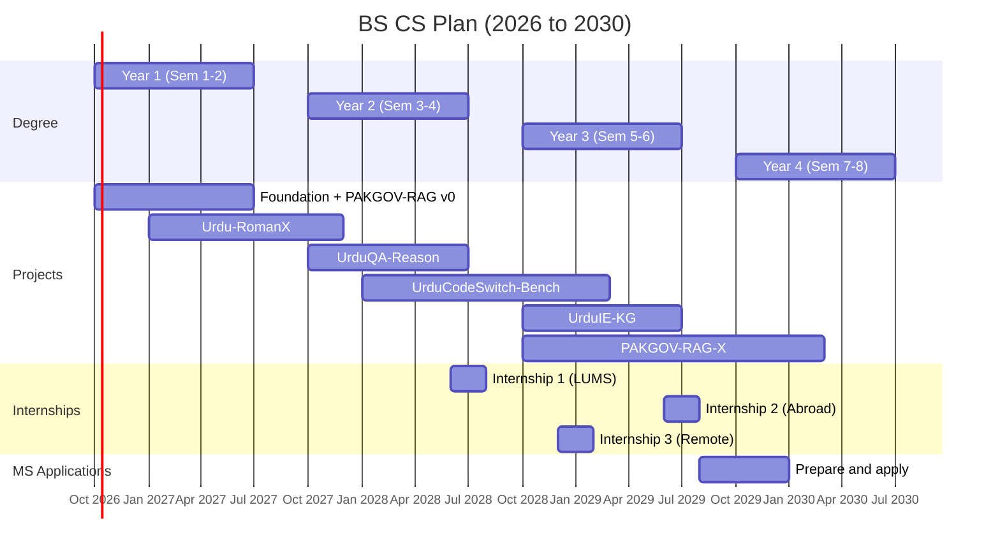
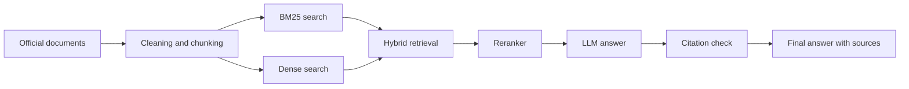
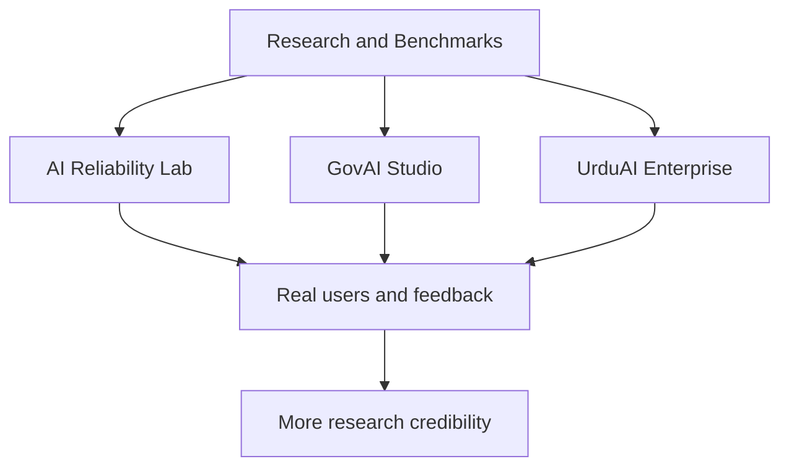

  

-8A2BE2?style=for-the-badge)

---

## 👋 About Me

Hello, I am **Salik Hussain**, a Computer Science student from Rawalpindi, Pakistan.

I started my **BS Computer Science at Iqra University Islamabad in October 2026**. My school background is Pre-Medical (F.Sc. PCB). I changed to Computer Science because I want to work in **Artificial Intelligence**.

My research interest is simple:

> **Can AI give correct, trusted answers in Urdu, Roman Urdu and Urdu-English mixed text?**

Most AI tools are built for English first. Millions of people who use Urdu are treated as an afterthought. I want to help fix that with careful research, open code and honest testing.

**My promise:** everything in this profile is either finished, in progress, or clearly marked as *planned*. I do not claim results that I have not earned yet.

---

## 🎯 My Goals

| Goal | Plan |
|:--|:--|
| 🎓 Degree | BS Computer Science, strong CGPA (target 3.7 or higher) |
| 🔬 Research | 3 research papers on Urdu NLP and trustworthy RAG |
| 💻 Projects | 5 flagship projects, finished properly one by one |
| 🧪 Experience | 3 research internships (one on-site, two research-focused abroad/remote) |
| 🌍 Next step | Fully funded MS in AI (around 2030) |
| 🏛️ Target universities | MBZUAI, KAUST, ETH Zurich, EPFL, TU Munich |

*These are targets, not promises. Admission always depends on the university.*

---

## 🧭 My 4-Year Journey

```mermaid
gantt
    title BS CS Plan (2026 to 2030)
    dateFormat YYYY-MM
    axisFormat %b %Y
    section Degree
    Year 1 (Sem 1-2)           :2026-10, 2027-07
    Year 2 (Sem 3-4)           :2027-10, 2028-07
    Year 3 (Sem 5-6)           :2028-10, 2029-07
    Year 4 (Sem 7-8)           :2029-10, 2030-07
    section Projects
    Foundation + PAKGOV-RAG v0 :2026-10, 2027-07
    Urdu-RomanX                :2027-01, 2027-12
    UrduQA-Reason              :2027-10, 2028-07
    UrduCodeSwitch-Bench       :2028-01, 2029-03
    UrduIE-KG                  :2028-10, 2029-07
    PAKGOV-RAG-X               :2028-10, 2030-03
    section Internships
    Internship 1 (LUMS)        :2028-06, 2028-08
    Internship 2 (Abroad)      :2029-06, 2029-08
    Internship 3 (Remote)      :2028-12, 2029-02
    section MS Applications
    Prepare and apply          :2029-08, 2030-01
```

---

## 🔬 The 5 Flagship Projects

I will not start all five together. I will finish one properly, then move on.

| # | Project | What it studies | Planned time |
|:-:|:--|:--|:--|
| 1 | **Urdu-RomanX** | Do AI models understand Urdu script, Roman Urdu and Urdu-English equally well? | Year 1 to Year 2 |
| 2 | **UrduQA-Reason** | Question answering with evidence, multi-step questions and "no answer" cases | Year 2 |
| 3 | **UrduCodeSwitch-Bench** | A test of AI reliability, facts and safety across Urdu, Roman Urdu and mixed text | Year 2 to Year 3 |
| 4 | **UrduIE-KG** | Finding names, places, laws and relations in Urdu text and building a knowledge graph | Year 3 |
| 5 | **PAKGOV-RAG-X** ⭐ | Bilingual RAG for Pakistani government and public information, with citations | Year 3 to Year 4 |

### ⭐ Flagship: PAKGOV-RAG-X

My earlier PAKGOV-RAG work is **Version 0 (pilot)**. I will upgrade it step by step.

```mermaid
flowchart LR
    A[Official documents] --> B[Cleaning and chunking]
    B --> C[BM25 search]
    B --> D[Dense search]
    C --> E[Hybrid retrieval]
    D --> E
    E --> F[Reranker]
    F --> G[LLM answer]
    G --> H[Citation check]
    H --> I[Final answer with sources]
```

**What I will measure:** Recall@5, Recall@10, MRR, nDCG, answer correctness, groundedness, citation precision and recall, unsupported claims, hallucination, abstention (saying "I don't know" when needed), speed and cost.

### Project Details

<b>1. Urdu-RomanX</b> (click to open)

- **Full name:** Robust Representation Learning for Urdu, Roman Urdu and Urdu-English Code-Switched Text
- **Tasks:** classification, NER, sentiment, similarity, retrieval, QA
- **Topics:** tokenization, transliteration, continued pretraining, PEFT, cross-script transfer
- **Models to compare first:** mBERT, XLM-R and existing Urdu models
- **Outputs:** dataset, evaluation suite, GitHub repo, Hugging Face page, web demo, paper
- **Tools:** Python, PyTorch, Hugging Face, SQL, Bash
- **Math needed:** linear algebra, probability, statistics, calculus, optimization

<b>2. UrduQA-Reason</b>

- **Full name:** Evidence-Grounded, Multi-Hop and Unanswerable Question Answering for Urdu and Urdu-English Public Information
- **Why it is different:** Urdu QA work already exists (for example UQA, LREC-COLING 2024). My contribution goes further: multi-hop questions, unanswerable questions, conflicting evidence and citations.
- **Metrics:** Recall@5, Recall@10, MRR, nDCG, EM, F1, evidence recall, citation correctness, unsupported-claim rate
- **Outputs:** dataset, benchmark, leaderboard, baseline systems, evaluation library

<b>3. UrduCodeSwitch-Bench</b>

- **Full name:** Reliability, Factuality, Safety and Robustness Evaluation of AI Models Across Urdu, Roman Urdu and Urdu-English Code-Switching
- **Main question:** Do modern AI systems keep the same quality, facts, grounding and safety when the language form changes?
- **Evaluates:** QA, classification, retrieval, summarization, factuality, hallucination, safety, consistency
- **Models:** several model families, not only my own
- **Outputs:** benchmark, dataset, evaluation framework, leaderboard, dashboard, paper

<b>4. UrduIE-KG</b>

- **Full name:** Urdu Information Extraction, Entity Linking, Relation Extraction and Knowledge-Graph Construction
- **Pipeline:** Urdu documents → NER → entity linking → relation extraction → event extraction → knowledge graph
- **Extracts:** people, organizations, locations, dates, laws, policies, events, relations
- **Tools:** Transformers, PyTorch, Wikidata, graph databases

<b>5. PAKGOV-RAG-X</b>

- **Full name:** Evidence-Grounded Bilingual Retrieval-Augmented Generation for Pakistani Government, Legal and Public Information
- **Languages:** English, Urdu, Roman Urdu
- **Compares:** BM25 vs Dense vs Hybrid vs Hybrid + Reranker vs RAG vs RAG + Verification
- **Outputs:** open-source code, benchmark, dataset (only where legally allowed), API, web app, evaluation dashboard, paper

---

## 📚 The 3 Research Papers

| Paper | Title | Based on | Possible venues |
|:-:|:--|:--|:--|
| 1 | Urdu-RomanX: Robust Representation Learning Across Urdu, Roman Urdu and Urdu-English Text | Project 1 | ACL, EMNLP, NAACL, COLING |
| 2 | UrduCodeSwitch-Bench: Reliability, Factuality and Safety Evaluation Across Urdu, Roman Urdu and Code-Switched Text | Project 3 | ACL, EMNLP, NAACL, NeurIPS Evaluations & Datasets |
| 3 | PAKGOV-RAG-X: Evidence-Grounded Bilingual RAG for Pakistani Government and Public Information | Project 5 | ACL, EMNLP, NAACL, SIGIR, NeurIPS E&D |

**Status:** all three are *planned*. The real contribution decides the venue, not the other way around.

---

## 🧪 The 3 Research Internships

| # | When | Where | Goal |
|:-:|:--|:--|:--|
| 1 | Summer 2028 (after Year 2) | **LUMS, on-site**, Urdu NLP group (Dr. Agha Ali Raza). Backup: NUST SEECS or NUST NCAI | First real research supervision and my first recommendation letter |
| 2 | Summer 2029 (after Year 3) | **Funded abroad program**: KAUST VSRP, ETH Summer Research Fellowship, EPFL Summer in the Lab, MBZUAI undergraduate research internship (if open) | A letter from a professor connected to my target universities |
| 3 | Winter break, Year 3 | **Remote research**: Urdu NLP group collaboration or Cohere Labs Scholars | A co-authored paper |

*I will check dates and eligibility on each official page before applying. Nothing here is guaranteed.*

---

## 💻 The 3 Future Products

These come from my research. They are **not** three separate startups.

```mermaid
flowchart TD
    R[Research and Benchmarks] --> P1[AI Reliability Lab]
    R --> P2[GovAI Studio]
    R --> P3[UrduAI Enterprise]
    P1 --> U[Real users and feedback]
    P2 --> U
    P3 --> U
    U --> C[More research credibility]
```

| Product | What it does | Who may use it |
|:--|:--|:--|
| **AI Reliability Lab** | Tests AI chatbots and RAG systems for hallucination, grounding, citations, safety and multilingual quality, then writes a report | AI teams, startups, researchers |
| **GovAI Studio** | Private document assistant with search, citations, summaries and source tracking | Law firms, universities, NGOs, compliance teams |
| **UrduAI Enterprise** | Urdu and Roman Urdu tools: search, QA, summarize, extract, classify | Education, telecom, media, fintech, support teams |

I will build only what real users ask for. I will not invent prices or user numbers.

---

## 🎓 My BS Computer Science Curriculum (Iqra University)

**Program facts:** 4 years, 8 semesters, 130 credit hours (45 courses). Pre-Medical students take 136 credit hours (47 courses) because of 2 extra Mathematics deficiency courses (6 credits).

Below is the official course list. Under each semester I added **My Focus**, which shows where my projects, papers and internships fit. **The curriculum itself is unchanged.**

### 📘 Year 1

<b>Semester 1 (Fall 2026)</b>

| Code | Course | Credits |
|:--|:--|:-:|
| CMC111 | Programming Fundamentals | 3+0 |
| CMC111-L | Programming Fundamentals (Lab) | 0+1 |
| GER111 | Application of ICT | 2+0 |
| GER111-L | Application of ICT (Lab) | 0+1 |
| GER121 | Functional English | 3+0 |
| IDS111 | IDS-I (Calculus & Analytic Geometry) | 3+0 |
| GERxxx | Natural Science* | 2+0 |
| GERxxx-L | Natural Science (Lab) | 0+1 |

**🎯 My Focus:** Get A grades in C programming and Calculus. Learn Git and Linux basics. Review my PAKGOV-RAG Version 0 and write down what to improve.

<b>Semester 2</b>

| Code | Course | Credits |
|:--|:--|:-:|
| GERxxx | Arts & Humanities* | 2+0 |
| CMC112 | Object-Oriented Programming | 3+0 |
| CMC112-L | Object-Oriented Programming (Lab) | 0+1 |
| CMC121 | Digital Logic Design | 3+0 |
| CMC121-L | Digital Logic Design (Lab) | 0+1 |
| IDS112 | IDS-II (Linear Algebra) | 3+0 |
| GERxxx | Quantitative Reasoning-I* | 3+0 |
| GER241 | Pakistan Studies | 2+0 |
| GEN111 | Understanding of the Holy Quran-I* | 0+1 |

**🎯 My Focus:** Learn Python for data work. Study Linear Algebra carefully (it is the base of AI). **Start Project 1 (Urdu-RomanX):** collect data and run first baseline tests.

### 📗 Year 2

<b>Semester 3</b>

| Code | Course | Credits |
|:--|:--|:-:|
| GERxxx | Quantitative Reasoning-II* | 3+0 |
| CMC331 | Database Systems | 3+0 |
| CMC331-L | Database Systems (Lab) | 0+1 |
| CMC251 | Data Structures | 3+0 |
| CMC251-L | Data Structures (Lab) | 0+1 |
| GERxxx | Social Science* | 2+0 |
| CMC262 | Computer Networks | 2+0 |
| CMC262-L | Computer Networks (Lab) | 0+1 |
| GEN112 | Understanding of the Holy Quran-II* | 0+1 |
| GER122 | Expository Writing | 3+0 |

**🎯 My Focus:** Use Databases and Data Structures in my projects. Continue **Urdu-RomanX** experiments. **Start Project 2 (UrduQA-Reason)** planning. Use Expository Writing to practice research writing.

<b>Semester 4</b>

| Code | Course | Credits |
|:--|:--|:-:|
| GER443 | Civics and Community Engagement | 2+0 |
| GER141 | Islamic Studies | 2+0 |
| GER464 | Entrepreneurship | 2+0 |
| CMC241 | Operating Systems | 3+0 |
| CMC241-L | Operating Systems (Lab) | 0+1 |
| CMC254 | Design & Analysis of Algorithms | 3+0 |
| GER142 | Ideology & Constitution of Pakistan | 2+0 |
| CMC371 | Software Engineering | 3+0 |

**🎯 My Focus:** Finish **Urdu-RomanX** and write **Paper 1**. Build **UrduQA-Reason**. Use Software Engineering to organize clean, tested code. Email Dr. Agha Ali Raza with my GitHub link, my results and a one-page plan.

**🧪 Summer 2028: Internship 1 (LUMS research).**

### 📙 Year 3

<b>Semester 5</b>

| Code | Course | Credits |
|:--|:--|:-:|
| CMC224 | Computer Org. & Architecture | 2+0 |
| CMC224-L | Computer Org. & Architecture (Lab) | 0+1 |
| CMC363 | Information Security | 2+0 |
| CMC363-L | Information Security (Lab) | 0+1 |
| CSC341 | Theory of Automata | 3+0 |
| CMC383 | Artificial Intelligence | 2+0 |
| CMC383-L | Artificial Intelligence (Lab) | 0+1 |
| IDSxxx | IDS-III* | 3+0 |
| IDSxxx | IDS-IV* | 3+0 |

**🎯 My Focus:** **Start Project 3 (UrduCodeSwitch-Bench)** with the AI course as support. Information Security helps with the safety testing part. **Apply in autumn 2028** to KAUST, ETH, EPFL and MBZUAI programs.

**🧪 Winter break: Internship 3 (remote research).**

<b>Semester 6</b>

| Code | Course | Credits |
|:--|:--|:-:|
| CMC355 | Cloud Computing | 3+0 |
| XXXXXX | Elective-I** | 3+0 |
| XXXXXX | Elective-II** | 3+0 |
| XXXXXX | Elective-III** | 3+0 |
| XXXXXX | Elective-IV** | 3+0 |

**🎯 My Focus:** Choose AI-related electives (for example NLP, Deep Learning, Machine Learning). Use Cloud Computing to deploy my demos. Build **Project 4 (UrduIE-KG)**. Finish **Paper 2**. Start **PAKGOV-RAG-X** upgrades.

**🧪 Summer 2029: Internship 2 (funded abroad program).**

### 📕 Year 4

<b>Semester 7</b>

| Code | Course | Credits |
|:--|:--|:-:|
| XXXXXX | Elective-V** | 3+0 |
| XXXXXX | Elective-VI** | 3+0 |
| XXXXXX | Elective-VII** | 3+0 |
| CMC493 | Field Experience / Internship*** | 3+0 |
| CMC491 | Final Year Design Project (FYDP)-I | 0+3 |

**🎯 My Focus:** Use my research internship for the CMC493 requirement where Iqra allows it (the program accepts remote and university-approved options). Make **PAKGOV-RAG-X** my Final Year Project. Prepare **MS applications**.

<b>Semester 8</b>

| Code | Course | Credits |
|:--|:--|:-:|
| CMC492 | Final Year Design Project (FYDP)-II | 0+3 |
| XXXXXX | Elective VIII** | 3+0 |
| CMC494 | Professional Certification*** | 3+0 |

**🎯 My Focus:** Finish the FYP and **Paper 3**. Release the final open-source code. Start the first version of my products. Complete the MS application process.

*Chosen from the university pools. **Offered from the electives of my chosen stream. ***The internship and certification can be done any time during the degree, preferably after Semester 5, and cannot be replaced by other coursework. Course details follow the Iqra University Prospectus 2026-27.

---

## 🧮 Skills

| Area | Topics I am learning |
|:--|:--|
| Programming | C, Python, Object-Oriented Programming, Data Structures, Algorithms |
| Math for AI | Calculus, Linear Algebra, Probability, Statistics, Optimization |
| AI | Machine Learning, Deep Learning, NLP, Transformers, LLMs, RAG, Information Retrieval |
| Engineering | Git, Linux, SQL, testing, APIs, deployment |

*Skills are listed as "learning" because I am at the start of my degree.*

---

## 📈 GitHub Activity

---

## 📜 My Working Rules

1. **Finish before starting.** One project at a time.
2. **Be honest.** No fake numbers, no "first ever" claims without proof.
3. **Respect rules.** Every dataset follows licenses, privacy and source permissions.
4. **Test everything.** Results must be repeatable.
5. **Grades first.** A strong CGPA supports everything else.

---

## 🤝 Let's Connect

I welcome advice from researchers, students and engineers, especially in Urdu NLP, multilingual AI and trustworthy RAG. If you are a supervisor with an opening for an undergraduate researcher, I would be grateful to hear from you.

📧 **salikhussain71@gmail.com**

