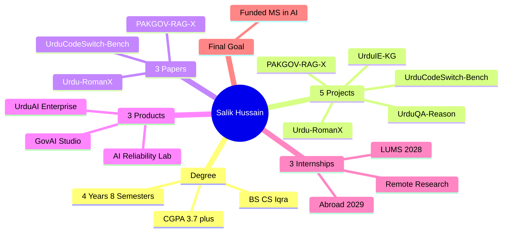
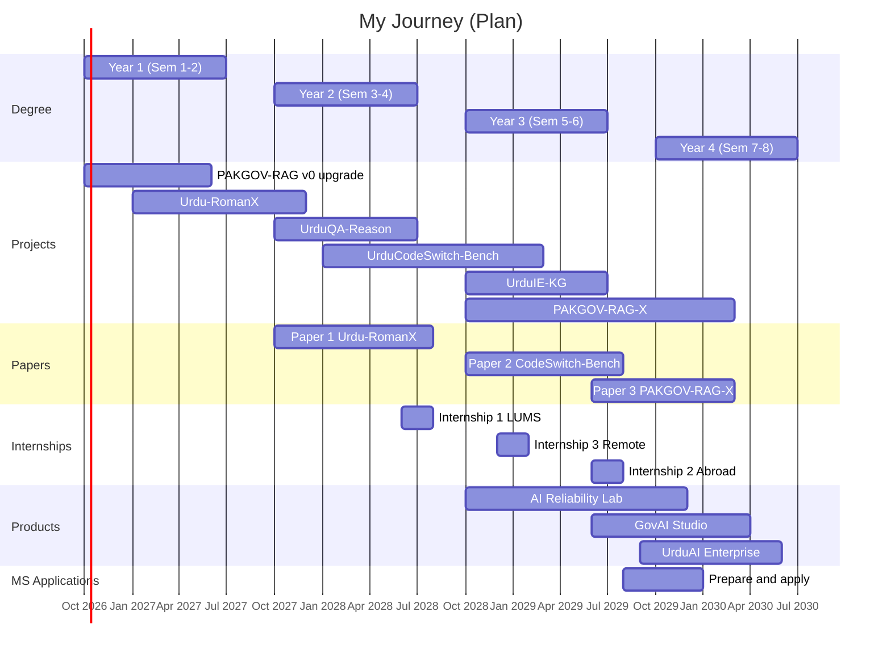
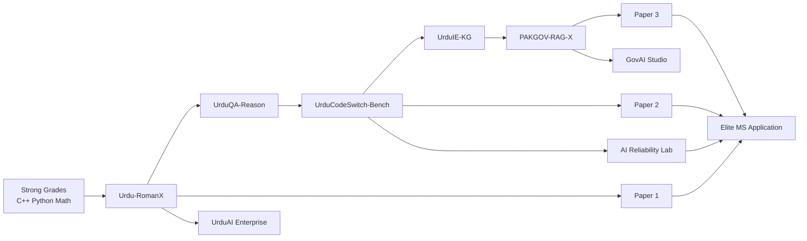
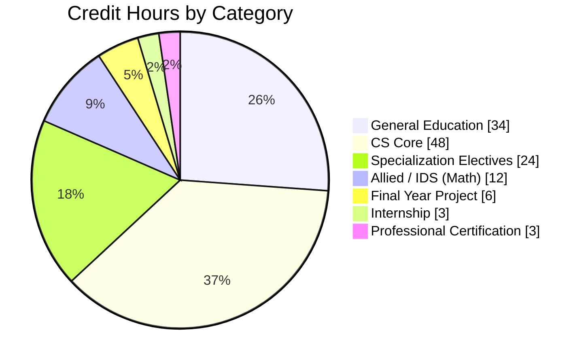
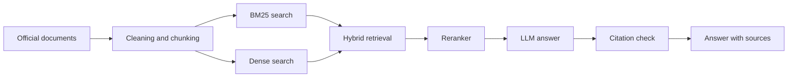
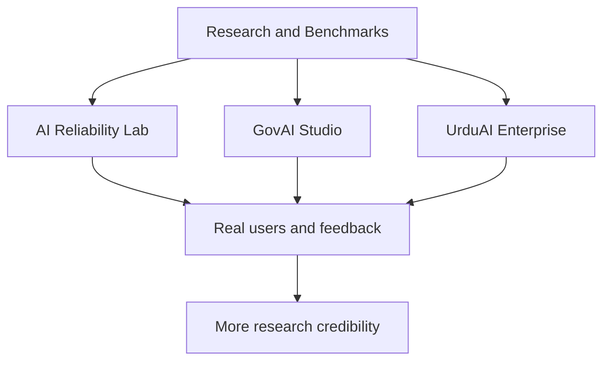

  

<picture>
  <source media="(prefers-color-scheme: dark)" srcset="https://raw.githubusercontent.com/salikhussain71-code/salikhussain71-code/output/github-contribution-grid-snake-dark.svg">
  <source media="(prefers-color-scheme: light)" srcset="https://raw.githubusercontent.com/salikhussain71-code/salikhussain71-code/output/github-contribution-grid-snake.svg">
  
</picture>

 

  

[

-8A2BE2?style=flat-square)](https://www.iqra.edu.pk/isl/)

---

## 👋 About Me

Hello, I am **Salik Hussain**, a Computer Science student from Rawalpindi, Pakistan.

I started my **BS Computer Science at [Iqra University Islamabad](https://www.iqra.edu.pk/isl/) in October 2026**. My school background is Pre-Medical (F.Sc. PCB). I moved to Computer Science because I want to build and research **Artificial Intelligence**.

My research question in one line:

> **Can AI give correct, trusted answers in Urdu, Roman Urdu and Urdu-English mixed text?**

**My promise:** everything on this page is either finished, in progress, or clearly marked **Planned**. I do not claim results I have not earned yet.

---

## 🗺️ My Whole Plan at a Glance

```mermaid
mindmap
  root((Salik Hussain))
    Degree
      BS CS Iqra
      4 Years 8 Semesters
      CGPA 3.7 plus
    5 Projects
      Urdu-RomanX
      UrduQA-Reason
      UrduCodeSwitch-Bench
      UrduIE-KG
      PAKGOV-RAG-X
    3 Papers
      Urdu-RomanX
      UrduCodeSwitch-Bench
      PAKGOV-RAG-X
    3 Products
      AI Reliability Lab
      GovAI Studio
      UrduAI Enterprise
    3 Internships
      LUMS 2028
      Abroad 2029
      Remote Research
    Final Goal
      Funded MS in AI
```

### 🎯 Goals

| Goal | Plan |
|:--|:--|
| 🎓 Degree | BS Computer Science, CGPA target 3.7 or higher |
| 🔬 Research | 3 papers on Urdu NLP and trustworthy RAG |
| 💻 Projects | 5 flagship projects, finished one by one |
| 🧪 Experience | 3 research internships |
| 💼 Products | 3 products built from my research |
| 🌍 Next step | Fully funded MS in AI around 2030 |

**Target universities:** [MBZUAI](https://mbzuai.ac.ae/) · [KAUST](https://www.kaust.edu.sa/) · [ETH Zurich](https://ethz.ch/) · [EPFL](https://www.epfl.ch/) · [TU Munich](https://www.tum.de/)

*These are targets, not promises. Admission always depends on the university.*

---

## 📅 Timeline (2026 to 2030)

```mermaid
gantt
    title My Journey (Plan)
    dateFormat YYYY-MM
    axisFormat %b %Y
    section Degree
    Year 1 (Sem 1-2)             :2026-10, 2027-07
    Year 2 (Sem 3-4)             :2027-10, 2028-07
    Year 3 (Sem 5-6)             :2028-10, 2029-07
    Year 4 (Sem 7-8)             :2029-10, 2030-07
    section Projects
    PAKGOV-RAG v0 upgrade        :2026-10, 2027-06
    Urdu-RomanX                  :2027-01, 2027-12
    UrduQA-Reason                :2027-10, 2028-07
    UrduCodeSwitch-Bench         :2028-01, 2029-03
    UrduIE-KG                    :2028-10, 2029-07
    PAKGOV-RAG-X                 :2028-10, 2030-03
    section Papers
    Paper 1 Urdu-RomanX          :2027-10, 2028-08
    Paper 2 CodeSwitch-Bench     :2028-10, 2029-08
    Paper 3 PAKGOV-RAG-X         :2029-06, 2030-03
    section Internships
    Internship 1 LUMS            :2028-06, 2028-08
    Internship 3 Remote          :2028-12, 2029-02
    Internship 2 Abroad          :2029-06, 2029-08
    section Products
    AI Reliability Lab           :2028-10, 2029-12
    GovAI Studio                 :2029-06, 2030-04
    UrduAI Enterprise            :2029-09, 2030-06
    section MS Applications
    Prepare and apply            :2029-08, 2030-01
```

### 🔗 How Everything Connects

```mermaid
flowchart LR
    A[Strong Grades<br/>C++ Python Math] --> B[Urdu-RomanX]
    B --> C[UrduQA-Reason]
    C --> D[UrduCodeSwitch-Bench]
    D --> E[UrduIE-KG]
    E --> F[PAKGOV-RAG-X]
    B --> P1[Paper 1]
    D --> P2[Paper 2]
    F --> P3[Paper 3]
    D --> S1[AI Reliability Lab]
    F --> S2[GovAI Studio]
    B --> S3[UrduAI Enterprise]
    P1 --> M[Elite MS Application]
    P2 --> M
    P3 --> M
    S1 --> M
```

### 📊 My Degree Structure (130 credit hours)

```mermaid
pie showData
    title Credit Hours by Category
    "General Education" : 34
    "CS Core" : 48
    "Specialization Electives" : 24
    "Allied / IDS (Math)" : 12
    "Final Year Project" : 6
    "Internship" : 3
    "Professional Certification" : 3
```

*Pre-Medical students take 136 credit hours (47 courses) because of 2 extra Mathematics deficiency courses (6 credits). Source: [Iqra University Prospectus 2026-27](https://www.iqra.edu.pk/isl/).*

---

# 🎓 YEAR-BY-YEAR PLAN

The course lists below are the official Iqra BS CS courses and are **unchanged**. For each year I added what I will build, write and apply for.

---

## 📘 YEAR 1 (2026 to 2027): Strong Foundation

 

**Year goal:** Get A grades. Learn to code well. Learn the math for AI. Start my first research project.

### Semester 1 (Fall 2026, started October 2026)

| Code | Course | Credits |
|:--|:--|:-:|
| CMC111 | Programming Fundamentals | 3+0 |
| CMC111-L | Programming Fundamentals (Lab) | 0+1 |
| GER111 | Application of ICT | 2+0 |
| GER111-L | Application of ICT (Lab) | 0+1 |
| GER121 | Functional English | 3+0 |
| IDS111 | IDS-I (Calculus & Analytic Geometry) | 3+0 |
| GERxxx | Natural Science* | 2+0 |
| GERxxx-L | Natural Science (Lab) | 0+1 |

**📚 What I will study in Semester 1**

| Subject | My study topics |
|:--|:--|
| **Programming Fundamentals (C++)** | Variables and data types, input/output, if/else, loops, functions, arrays, strings, pointers, structures, file handling, debugging, problem solving |
| **Calculus & Analytic Geometry** | Functions, limits, derivatives, integrals, applications, lines, circles and conics |
| **Application of ICT** | Office tools, internet safety, basic networks, how computers work |
| **Functional English** | Grammar, reading, clear writing, speaking, presentations |
| **Natural Science** | Chosen from the university pool, with lab work |

**🎯 Year 1 build list**

- [ ] Finish Semester 1 with strong grades in C++ and Calculus
- [ ] Learn Git and Linux basics (daily small commits)
- [ ] Review **PAKGOV-RAG Version 0** and list what to improve
- [ ] Learn Python for data work

### Semester 2

| Code | Course | Credits |
|:--|:--|:-:|
| GERxxx | Arts & Humanities* | 2+0 |
| CMC112 | Object-Oriented Programming | 3+0 |
| CMC112-L | Object-Oriented Programming (Lab) | 0+1 |
| CMC121 | Digital Logic Design | 3+0 |
| CMC121-L | Digital Logic Design (Lab) | 0+1 |
| IDS112 | IDS-II (Linear Algebra) | 3+0 |
| GERxxx | Quantitative Reasoning-I* | 3+0 |
| GER241 | Pakistan Studies | 2+0 |
| GEN111 | Understanding of the Holy Quran-I* | 0+1 |

**🎯 Sem 2 focus:** Study Linear Algebra carefully (it is the base of AI). **Start Project 1: Urdu-RomanX** (collect data, run first baseline tests).

### 📦 Year 1 Output

| Type | Item | Status |
|:--|:--|:-:|
| Project | PAKGOV-RAG v0 upgrade | 🟡 Planned |
| Project | Urdu-RomanX (start) | 🟡 Planned |
| Skills | C++, Python, Git, Linux, Calculus, Linear Algebra | 🟢 Learning |

---

## 📗 YEAR 2 (2027 to 2028): First Real Research

 

**Year goal:** Finish Project 1, build Project 2, write Paper 1, and get my first research supervisor.

### Semester 3

| Code | Course | Credits |
|:--|:--|:-:|
| GERxxx | Quantitative Reasoning-II* | 3+0 |
| CMC331 | Database Systems | 3+0 |
| CMC331-L | Database Systems (Lab) | 0+1 |
| CMC251 | Data Structures | 3+0 |
| CMC251-L | Data Structures (Lab) | 0+1 |
| GERxxx | Social Science* | 2+0 |
| CMC262 | Computer Networks | 2+0 |
| CMC262-L | Computer Networks (Lab) | 0+1 |
| GEN112 | Understanding of the Holy Quran-II* | 0+1 |
| GER122 | Expository Writing | 3+0 |

**🎯 Sem 3 focus:** Use Databases and Data Structures inside my projects. Continue Urdu-RomanX experiments. Start planning **UrduQA-Reason**. Use Expository Writing to practice research writing.

### Semester 4

| Code | Course | Credits |
|:--|:--|:-:|
| GER443 | Civics and Community Engagement | 2+0 |
| GER141 | Islamic Studies | 2+0 |
| GER464 | Entrepreneurship | 2+0 |
| CMC241 | Operating Systems | 3+0 |
| CMC241-L | Operating Systems (Lab) | 0+1 |
| CMC254 | Design & Analysis of Algorithms | 3+0 |
| GER142 | Ideology & Constitution of Pakistan | 2+0 |
| CMC371 | Software Engineering | 3+0 |

**🎯 Sem 4 focus:** Finish Urdu-RomanX and write **Paper 1**. Build UrduQA-Reason. Use Software Engineering for clean, tested code. Use Entrepreneurship to plan my first product idea. Email the LUMS supervisor with my GitHub link, my results and a one-page plan.

### 🧪 Internship 1: Summer 2028

**[LUMS](https://lums.edu.pk/), on-site research.** Host: Dr. Agha Ali Raza (Urdu NLP). Backup: [NUST SEECS](https://seecs.nust.edu.pk/) or NUST NCAI.
*Also see: [LUMS Summer Research Programme](https://or.lums.edu.pk/node/9688) · [LUMS Students as Co-Researchers](https://lli.lums.edu.pk/students-co-researchers).*
**Aim:** my first real research supervision and my first recommendation letter. This is a request, not a confirmed vacancy.

### 📦 Year 2 Output

| Type | Item | Status |
|:--|:--|:-:|
| Project | Urdu-RomanX (finish) | 🟡 Planned |
| Project | UrduQA-Reason | 🟡 Planned |
| Paper | Paper 1: Urdu-RomanX | 🟡 Planned |
| App | Urdu-RomanX web demo | 🟡 Planned |
| Dataset | Urdu-RomanX dataset | 🟡 Planned |
| Internship | LUMS research (summer 2028) | 🟡 Planned |

---

## 📙 YEAR 3 (2028 to 2029): Elite Research

 

**Year goal:** Build the benchmark, finish Paper 2, win a funded abroad research place, and start my first product.

### Semester 5

| Code | Course | Credits |
|:--|:--|:-:|
| CMC224 | Computer Org. & Architecture | 2+0 |
| CMC224-L | Computer Org. & Architecture (Lab) | 0+1 |
| CMC363 | Information Security | 2+0 |
| CMC363-L | Information Security (Lab) | 0+1 |
| CSC341 | Theory of Automata | 3+0 |
| CMC383 | Artificial Intelligence | 2+0 |
| CMC383-L | Artificial Intelligence (Lab) | 0+1 |
| IDSxxx | IDS-III* | 3+0 |
| IDSxxx | IDS-IV* | 3+0 |

**🎯 Sem 5 focus:** Start **UrduCodeSwitch-Bench** with the AI course as support. Information Security helps with the safety-testing part. **Apply in autumn 2028** to the abroad programs below.

### Semester 6

| Code | Course | Credits |
|:--|:--|:-:|
| CMC355 | Cloud Computing | 3+0 |
| XXXXXX | Elective-I** | 3+0 |
| XXXXXX | Elective-II** | 3+0 |
| XXXXXX | Elective-III** | 3+0 |
| XXXXXX | Elective-IV** | 3+0 |

**🎯 Sem 6 focus:** Choose AI-related electives (for example NLP, Machine Learning, Deep Learning). Use Cloud Computing to deploy my demos. Build **UrduIE-KG**. Finish **Paper 2**. Start the first version of **AI Reliability Lab**.

### 🧪 Internship 3: Winter Break 2028 (Remote Research)

Options: a remote collaboration with an Urdu NLP group, or [Cohere Labs Scholars](https://cohere.com/research). **Aim:** a co-authored paper.

### 🧪 Internship 2: Summer 2029 (Funded, Abroad)

Apply in **autumn 2028**. Apply to all, because competition is tough:

| Program | Link |
|:--|:--|
| KAUST Visiting Student Research Program | [admissions.kaust.edu.sa](https://admissions.kaust.edu.sa/study/internships) |
| MBZUAI Global Research Internship Program | [mbzuai.ac.ae](https://mbzuai.ac.ae/academics/pathway-programs/mbzuai-global-research-internship-program) |
| ETH Zurich Summer Research Fellowship | [ethz.ch](https://ethz.ch/) |
| EPFL Summer in the Lab | [epfl.ch](https://www.epfl.ch/) |

**Aim:** a recommendation letter from a professor connected to my target universities. This is the most valuable item for my MS applications. *I will check each program's official page for dates and eligibility (for example, MBZUAI states a minimum CGPA). I have not confirmed the 2028-29 cycle.*

### 📦 Year 3 Output

| Type | Item | Status |
|:--|:--|:-:|
| Project | UrduCodeSwitch-Bench | 🟡 Planned |
| Project | UrduIE-KG | 🟡 Planned |
| Paper | Paper 2: UrduCodeSwitch-Bench | 🟡 Planned |
| App | UrduCodeSwitch-Bench Leaderboard | 🟡 Planned |
| App | UrduIE-KG web interface + API | 🟡 Planned |
| Product | AI Reliability Lab v1 | 🟡 Planned |
| Internships | Remote research + funded abroad | 🟡 Planned |

---

## 📕 YEAR 4 (2029 to 2030): Flagship, Products, MS Applications

 

**Year goal:** Finish the flagship project, write Paper 3, launch my products, and apply for MS.

### Semester 7

| Code | Course | Credits |
|:--|:--|:-:|
| XXXXXX | Elective-V** | 3+0 |
| XXXXXX | Elective-VI** | 3+0 |
| XXXXXX | Elective-VII** | 3+0 |
| CMC493 | Field Experience / Internship*** | 3+0 |
| CMC491 | Final Year Design Project (FYDP)-I | 0+3 |

**🎯 Sem 7 focus:** Use my research internship for CMC493 if Iqra approves it (the program allows on-site, remote, university-assigned and bootcamp options). Make **PAKGOV-RAG-X** my Final Year Project. Prepare **MS applications**.

### Semester 8

| Code | Course | Credits |
|:--|:--|:-:|
| CMC492 | Final Year Design Project (FYDP)-II | 0+3 |
| XXXXXX | Elective VIII** | 3+0 |
| CMC494 | Professional Certification*** | 3+0 |

**🎯 Sem 8 focus:** Finish the FYP and **Paper 3**. Release the final open-source code. Launch the first versions of **GovAI Studio** and **UrduAI Enterprise**. Complete the MS application process.

*Chosen from the university pools. **Offered from the electives of my chosen stream. ***Can be done any time in the degree, preferably after Semester 5, and cannot be replaced by other coursework.

### 📦 Year 4 Output

| Type | Item | Status |
|:--|:--|:-:|
| Project | PAKGOV-RAG-X (flagship) | 🟡 Planned |
| Paper | Paper 3: PAKGOV-RAG-X | 🟡 Planned |
| App | PAKGOV-RAG-X web app + evaluation dashboard | 🟡 Planned |
| Product | GovAI Studio | 🟡 Planned |
| Product | UrduAI Enterprise | 🟡 Planned |
| Goal | MS applications | 🟡 Planned |

---

# 🔬 THE 5 FLAGSHIP PROJECTS

| # | Project | Question it answers | Year |
|:-:|:--|:--|:-:|
| 1 | **Urdu-RomanX** | Do models understand Urdu, Roman Urdu and Urdu-English equally well? | 1 to 2 |
| 2 | **UrduQA-Reason** | Can AI answer with evidence, multi-step reasoning and "no answer" cases? | 2 |
| 3 | **UrduCodeSwitch-Bench** | How reliable and safe is AI across language forms? | 2 to 3 |
| 4 | **UrduIE-KG** | Can we extract people, places, laws and relations from Urdu text? | 3 |
| 5 | **PAKGOV-RAG-X** ⭐ | Can AI answer Pakistani government questions with real sources? | 3 to 4 |

### ⭐ Flagship: PAKGOV-RAG-X

My earlier PAKGOV-RAG is **Version 0 (pilot)**. I upgrade it step by step.

```mermaid
flowchart LR
    A[Official documents] --> B[Cleaning and chunking]
    B --> C[BM25 search]
    B --> D[Dense search]
    C --> E[Hybrid retrieval]
    D --> E
    E --> F[Reranker]
    F --> G[LLM answer]
    G --> H[Citation check]
    H --> I[Answer with sources]
```

**Measured with:** Recall@5, Recall@10, MRR, nDCG, answer correctness, groundedness, citation precision and recall, unsupported claims, hallucination, abstention, speed and cost.

<b>1. Urdu-RomanX</b>

- **Full name:** Robust Representation Learning for Urdu, Roman Urdu and Urdu-English Code-Switched Text
- **Study:** tokenization, transliteration, continued pretraining, PEFT, cross-script transfer
- **Tasks:** classification, NER, sentiment, similarity, retrieval, QA
- **Compare first:** mBERT, XLM-R and existing Urdu models
- **Outputs:** dataset, model (only if experiments justify it), benchmark, evaluation suite, GitHub, Hugging Face, web demo, paper
- **Languages and tools:** Python, SQL, Bash, C++, later TypeScript/JavaScript
- **Math:** linear algebra, probability, statistics, calculus, optimization

<b>2. UrduQA-Reason</b>

- **Full name:** Evidence-Grounded, Multi-Hop and Unanswerable Question Answering for Urdu and Urdu-English Public Information
- **Why different:** Urdu QA work already exists (for example UQA, LREC-COLING 2024). Mine adds multi-hop, comparison, unanswerable and conflicting-evidence questions with citations.
- **Pipeline:** Question → Retriever → Evidence → Reranker → LLM → Answer → Citation check
- **Metrics:** Recall@5, Recall@10, MRR, nDCG, EM, F1, evidence recall, citation correctness, unsupported-claim rate
- **Outputs:** dataset, benchmark, leaderboard, baselines, RAG system, evaluation library, paper

<b>3. UrduCodeSwitch-Bench</b>

- **Full name:** Reliability, Factuality, Safety and Robustness Evaluation of AI Models Across Urdu, Roman Urdu and Urdu-English Code-Switching
- **Evaluates:** QA, classification, retrieval, summarization, factuality, hallucination, safety, robustness, consistency
- **Models:** several model families, not only mine
- **Outputs:** benchmark, dataset, evaluation framework, leaderboard, dashboard, research report, paper

<b>4. UrduIE-KG</b>

- **Full name:** Urdu Information Extraction, Entity Linking, Relation Extraction and Knowledge-Graph Construction
- **Pipeline:** Urdu documents → NER → entity linking → relation extraction → event extraction → knowledge graph
- **Extracts:** people, organizations, locations, dates, laws, policies, events, relationships
- **Tools:** Transformers, PyTorch, [Wikidata](https://www.wikidata.org/), graph databases
- **Outputs:** dataset, NER model, entity-linking system, relation extractor, knowledge graph, API, web interface

<b>5. PAKGOV-RAG-X</b>

- **Full name:** Evidence-Grounded Bilingual Retrieval-Augmented Generation for Pakistani Government, Legal and Public Information
- **Languages:** English, Urdu, Roman Urdu
- **Compares:** BM25 vs Dense vs Hybrid vs Hybrid + Reranker vs RAG vs RAG + Verification
- **Outputs:** open-source code, benchmark, dataset (only where legally allowed), models, API, web app, evaluation dashboard, paper

---

# 📚 THE 3 RESEARCH PAPERS

| # | Title | From | Possible venues |
|:-:|:--|:--|:--|
| 1 | Urdu-RomanX: Robust Representation Learning Across Urdu, Roman Urdu and Urdu-English Text | Project 1 | [ACL](https://aclrollingreview.org/) · [EMNLP](https://www.aclweb.org/) · [NAACL](https://naacl.org/) · COLING |
| 2 | UrduCodeSwitch-Bench: Reliability, Factuality and Safety Evaluation Across Urdu, Roman Urdu and Code-Switched Text | Project 3 | ACL · EMNLP · NAACL · [NeurIPS Evaluations & Datasets](https://neurips.cc/) |
| 3 | PAKGOV-RAG-X: Evidence-Grounded Bilingual RAG for Pakistani Government and Public Information | Project 5 | ACL · EMNLP · NAACL · [SIGIR](https://sigir.org/) · NeurIPS E&D |

**Status:** all three are **Planned**. The real contribution decides the venue.

---

# 💻 THE 3 PRODUCTS, APPS AND APIs

```mermaid
flowchart TD
    R[Research and Benchmarks] --> P1[AI Reliability Lab]
    R --> P2[GovAI Studio]
    R --> P3[UrduAI Enterprise]
    P1 --> U[Real users and feedback]
    P2 --> U
    P3 --> U
    U --> C[More research credibility]
```

| Product | What it does | Who may use it | Year |
|:--|:--|:--|:-:|
| **AI Reliability Lab** | Tests LLM, RAG and AI-agent systems for hallucination, grounding, retrieval, citations, safety and multilingual quality, then writes a report (score → failures → evidence → recommendations) | AI startups, software teams, researchers | 3 to 4 |
| **GovAI Studio** | Private document assistant: search, RAG, citations, summaries, comparison, source tracking, audit trail | Law firms, universities, NGOs, compliance teams | 4 |
| **UrduAI Enterprise** | Urdu and Roman Urdu infrastructure with APIs | Education, telecom, media, e-commerce, fintech, support teams | 4 |

**UrduAI Enterprise APIs (build only what users need):** `/search` · `/qa` · `/summarize` · `/extract` · `/classify` · `/rag` · `/evaluate`

### 🌐 Apps and Systems I Will Build

| App | Purpose | Year |
|:--|:--|:-:|
| Urdu-RomanX Web Demo | Try Urdu, Roman Urdu and mixed text with models | 2 |
| UrduCodeSwitch-Bench Leaderboard | Model, task, language, score and failure rate | 3 |
| AI Reliability Lab Dashboard | Upload a system, get a reliability report | 3 to 4 |
| UrduIE-KG Explorer | Browse the Urdu knowledge graph | 3 |
| PAKGOV-RAG-X Web App | Ask government questions with citations | 4 |
| Evaluation Dashboard | Compare model versions and spot regressions | 4 |

### 💡 Later Product Ideas (only after the core ones work)

| Idea | What it does |
|:--|:--|
| **RegulaPak** | Detects changes in official regulations and shows the old text, new text, date and source |
| **PakVoice** | Urdu and English voice assistant that answers with evidence |
| **PAKAI Verify** | A wider version of AI Reliability Lab for global developers |

*I will not invent prices, user numbers or revenue. Every dataset must respect licenses, privacy and source permissions.*

---

# 🧪 THE 3 INTERNSHIPS (Summary)

| # | When | Where | Aim |
|:-:|:--|:--|:--|
| 1 | Summer 2028 | [LUMS](https://lums.edu.pk/), on-site, Urdu NLP | First research supervision and first letter |
| 2 | Summer 2029 | [KAUST](https://admissions.kaust.edu.sa/study/internships) · [MBZUAI](https://mbzuai.ac.ae/academics/pathway-programs/mbzuai-global-research-internship-program) · [ETH](https://ethz.ch/) · [EPFL](https://www.epfl.ch/) | Strongest letter for MS |
| 3 | Winter break, Year 3 | Remote research / [Cohere Labs](https://cohere.com/research) | Co-authored paper |

### ✉️ Recommendation Letters (3 needed)

1. The LUMS supervisor (Internship 1)
2. The professor from the abroad program (Internship 2), the strongest one
3. An Iqra professor who has seen my grades and effort in Programming, Algorithms and AI

---

# 🧮 SKILLS AND TOOLS

| Area | Topics |
|:--|:--|
| Programming | C++, Python, Object-Oriented Programming, Data Structures, Algorithms |
| Math for AI | Calculus, Linear Algebra, Probability, Statistics, Optimization |
| AI | Machine Learning, Deep Learning, NLP, Transformers, LLMs, RAG, Information Retrieval |
| Engineering | Git, Linux, SQL, testing, APIs, cloud deployment |

*Skills are marked "learning" because I am at the start of my degree.*

### 🔗 Learning Links

[Harvard CS50P](https://cs50.harvard.edu/python/) · [Hugging Face Courses](https://huggingface.co/learn) · [Kaggle Learn](https://www.kaggle.com/learn) · [ACL Anthology](https://aclanthology.org/) · [arXiv cs.CL](https://arxiv.org/list/cs.CL/recent) · [Papers with Code](https://paperswithcode.com/)

---

# 📈 GITHUB ACTIVITY

---

## 📜 My Working Rules

1. **Finish before starting.** One project at a time.
2. **Be honest.** No fake numbers and no "first ever" claims without proof.
3. **Respect rules.** Every dataset follows licenses, privacy and permissions.
4. **Test everything.** Results must be repeatable.
5. **Grades first.** A strong CGPA supports everything else.

---

## 🤝 Let's Connect

I welcome advice from researchers, students and engineers, especially in Urdu NLP, multilingual AI and trustworthy RAG. If you supervise undergraduate researchers, I would be grateful to hear from you.

📧 **salikhussain71@gmail.com**

